[](https://mcptoplist.com/server/glama%2Fmikrotik-mcp)

<div align="center">
  
  <p><strong>Drive one or more MikroTik routers in plain language — 885 risk-annotated tools your AI can call, over SSH.</strong><br/>
  Firewall · routing · DHCP/DNS · wireless · QoS · a complete VPN suite · transactional Safe Mode · live attack detection · and an observability dashboard that watches every call.</p>

  <p>
    <a href="LICENSE"></a>
    
    
    
    <a href="docs/"></a>
  </p>
</div>

---

`@usex/mikrotik-mcp` turns **MikroTik RouterOS** into **885 [Model Context Protocol](https://modelcontextprotocol.io)
tools** any MCP client (Claude Desktop, Claude Code, Cursor, …) can call to read and
configure your router by talking to it. It reaches the device over **plain SSH** — no
agent, no package to install on RouterOS — runs on **[Bun](https://bun.sh)**, and
validates every call against a schema.

Point it at a router and go:

```jsonc
// claude_desktop_config.json
{
  "mcpServers": {
    "mikrotik": {
      "command": "mikrotik-mcp",
      "env": {
        "MIKROTIK_HOST": "192.168.88.1",
        "MIKROTIK_USERNAME": "admin",
        "MIKROTIK_PASSWORD": "your-password",
      },
    },
  },
}
```

Then just ask:

> _"Show me the firewall input chain, then block SSH from the WAN under safe mode."_
> _"Build an IKEv2 site-to-site tunnel to 203.0.113.5 for 192.168.20.0/24."_
> _"Why can't VLAN 50 reach the internet?"_

## Highlights

- 🧰 **885 tools, one per RouterOS scope** — L2 (bridge, VLAN, wireless, PoE),
  L3 (addressing, routing, DHCP, DNS), security (firewall, NAT, address-lists,
  certificates), QoS, and system ops (users, logs, backups, scheduler).
- 🛡️ **Attack detection** — reads every device's log, correlates brute force,
  credential spraying and _a login that succeeded after failures_ into incidents with
  evidence, and can block the source with a timed, reversible entry. Detect-only until
  you say otherwise. [→](docs/attack-detection.md)
- ⏱️ **Scheduled audits** — run the auditors on a cron with nobody in the loop, and
  hear only about what **changed** since the last run: new, worsened, resolved.
  [→](docs/scheduled-audits.md)
- 📖 **`explain_device`** — turns a config into the architecture document that should
  have been in the wiki (topology diagram, what's exposed, what each chain does), and
  explains what the difference between two snapshots actually _means_.
  [→](docs/config-narrative.md)
- 🧪 **Offline simulator** — trace a hypothetical packet through NAT, routing and
  firewall against a snapshot, with no device in the loop. Reports UNKNOWN rather than
  guessing. [→](docs/simulator.md)
- 📊 **Live observability dashboard** — a localhost web UI that shows **every tool
  call the AI makes** in real time: inputs, outputs, latency, errors, per-device
  analytics. Secrets redacted. [Jump to it ↓](#-observability-dashboard)
- 🔐 **Complete VPN suite** — WireGuard, IPsec (IKEv1/IKEv2), L2TP, PPTP, SSTP,
  OpenVPN, plus GRE/IPIP/EoIP/VXLAN. A `choose-vpn-solution` prompt picks one for you.
- 🛟 **Safe Mode** — wrap risky changes in a real transactional window; RouterOS
  holds them in memory and **auto-reverts if your session drops**, so you can't lock
  yourself out.
- 🚦 **Risk-annotated** — every tool is tagged read / write / destructive, so clients
  auto-approve reads and prompt on writes.
- 🧱 **Injection-safe** — a command builder quotes/escapes every value; a hostname
  like `LAN; /system reset` can never split into a second command.
- 🖧 **Multiple devices** — name your routers and target one per call; configure
  **both ends of a tunnel** in one conversation.
- 🪜 **SSH jump hosts** — reach a router with no exposed port by tunnelling through a
  bastion (`jumpVia`); commands, Safe Mode and file upload all ride the hop.
- ⚡ **Connection pooling** — one persistent SSH session per device saves ~200-500 ms
  per command.
- 🔀 **REST API, opt-in** — point a device at RouterOS 7.9+'s `/rest` for structured
  JSON and real HTTP status codes, with automatic SSH fallback for anything REST
  can't express. Per-device, off by default.

## Install

```bash
# Requires Bun ≥ 1.3 — https://bun.sh
bun add -g @usex/mikrotik-mcp

# Point it at your router and verify SSH connectivity
MIKROTIK_HOST=192.168.88.1 MIKROTIK_USERNAME=admin MIKROTIK_PASSWORD=•••• \
  mikrotik-mcp auth-check

# Wire it into your MCP client (stdio by default)
mikrotik-mcp serve
```

Prefer **SSH keys**? Swap the password for a key file (add a passphrase if it's encrypted):

```bash
MIKROTIK_HOST=192.168.88.1 MIKROTIK_USERNAME=admin \
MIKROTIK_KEY_FILENAME=~/.ssh/id_ed25519 \
MIKROTIK_KEY_PASSPHRASE=•••• \
  mikrotik-mcp auth-check     # prints "Auth mode: SSH key"
```

Prefer a **one-click bundle** (no Bun/Node/npm on the machine, credentials entered in
the host UI)? Build an `.mcpb` and drag it into Claude Desktop → Settings → Extensions:

```bash
bun run build:mcp                    # bundle for this machine
bun run build:mcp --target linux-x64 # or one target · build:mcp:all for every target
```

Full options: **[docs/configuration.md](docs/configuration.md)** · MCPB details:
**[docs/getting-started.md](docs/getting-started.md)**.

## Simple usage — by scenario

Once the server is wired into your client, everything below is a **plain-language
request**. The AI picks the right tool, validates it, and runs it. No CLI syntax to memorize.

### 🔎 See what's on the router

> _"List the firewall filter rules and flag anything that allows WAN → LAN."_
> _"What DHCP leases are active right now?"_
> _"Show interface traffic and tell me which port is saturated."_

All read-only — safe to auto-approve.

### 🧱 Make a change, safely

> _"Enable safe mode, block inbound SSH on the WAN, then commit if I'm still connected."_

Safe Mode holds the change in memory and reverts automatically if you lock yourself out:

```text
enable_safe_mode → (make changes) → commit_safe_mode    # persist
                                   → rollback_safe_mode  # discard
```

### 🔐 Stand up a VPN

> _"Create a WireGuard interface on port 13231 and generate a client config for my laptop."_
> _"Build an IKEv2 site-to-site tunnel to 203.0.113.5 for 192.168.20.0/24."_

Not sure which VPN? Ask the **`choose-vpn-solution`** prompt — it recommends one and
outlines the build. Every technology is covered:

| Need                                | Use                     | Build it with                                                                          |
| ----------------------------------- | ----------------------- | -------------------------------------------------------------------------------------- |
| MikroTik ↔ MikroTik, modern clients | **WireGuard**           | `create_wireguard_interface`, `add_wireguard_peer`, `generate_wireguard_client_config` |
| Interop site-to-site / native IKEv2 | **IPsec**               | `create_ipsec_{profile,peer,identity,proposal,policy}`, `get_ipsec_active_peers`       |
| Built-in OS VPN clients             | **L2TP/IPsec**          | `set_l2tp_server`, `create_ppp_secret`, `create_ppp_profile`                           |
| Through restrictive firewalls       | **SSTP** (TLS)          | `set_sstp_server`, `create_sstp_client`                                                |
| Cross-platform                      | **OpenVPN**             | `set_ovpn_server`, `create_ovpn_client`                                                |
| Route / L2-bridge between sites     | **GRE/IPIP/EoIP/VXLAN** | `create_gre_tunnel`, `create_eoip_tunnel`, `create_vxlan_tunnel`                       |

Details: **[docs/vpn-guide.md](docs/vpn-guide.md)**.

### 🖧 Manage several routers at once

Name your routers and drive them all from one conversation — exactly what you need to
**set up a tunnel between two MikroTiks and test it from both ends**:

```jsonc
// devices.json
{
  "defaultDevice": "site-a",
  "devices": {
    "site-a": { "host": "203.0.113.10", "username": "admin", "keyFilename": "/keys/site-a" },
    "site-b": { "host": "198.51.100.20", "username": "admin", "password": "••••" },
  },
}
```

```bash
mikrotik-mcp serve --config ./devices.json
mikrotik-mcp devices        # site-a (default) · site-b
```

Every tool gains an optional `device` argument, and **Safe Mode is per-device**:

> _"On site-a create a WireGuard interface, on site-b add it as a peer, then ping across."_

Behind a bastion with no exposed port? Jump through another router (`jumpVia`) —
commands, Safe Mode and SFTP all ride the hop. Full guide:
**[docs/multi-device.md](docs/multi-device.md)**.

### 🩺 Diagnose and harden

> _"Why can't VLAN 50 reach the internet?"_
> _"Audit my firewall for shadowed and overly-broad rules."_
> _"Harden this router and show me the exact diff before committing."_

These map to higher-level workflows — [firewall audit](docs/firewall-audit.md),
[security hardening](docs/security-hardening.md), [change plan & dry-run](docs/change-plan.md) —
each read-only to inspect, dry-run + Safe Mode to fix.

## 📊 Observability dashboard

**A localhost web dashboard that watches every tool call the LLM makes against this
server — in real time.** Off by default, zero overhead until you flip it on, and it runs
alongside whatever transport you use:

```bash
mikrotik-mcp serve --dashboard          # → http://127.0.0.1:9090
```

<div align="center">
  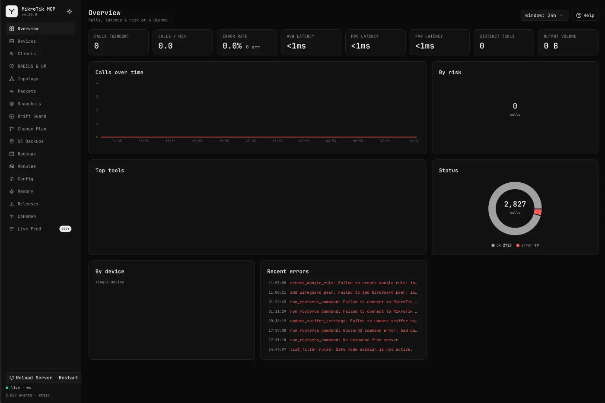
</div>

Every call flows through one choke point in the registry, so the dashboard sees **all
of them, across every transport**. Why you'll want it on:

- 👁️ **Live feed of every call** — tool, inputs, outputs, target device, duration,
  success/error — streaming in over a Bun-native WebSocket (SSE fallback). Filter by
  tool / risk / device / status / free-text, pause & resume, export to CSV or JSON.
- 📈 **Analytics at a glance** — calls in window, calls/min, error rate, avg / p95 / p99
  latency, distinct tools, output volume; top tools, by-risk and status donuts,
  by-device bars, and a recent-errors panel.
- 🔒 **Secrets redacted before storage** — any password, private key, PSK or token is
  replaced with `«redacted»` before anything is stored or streamed. Set
  `--dashboard-capture-body=false` to keep metadata only.
- 🕸️ **Devices & connectivity map** — a hub-and-spoke graph of the server to each
  device, coloured by live SSH reachability, with per-device online/offline, latency,
  RouterOS identity/version and recent activity.

<div align="center">
  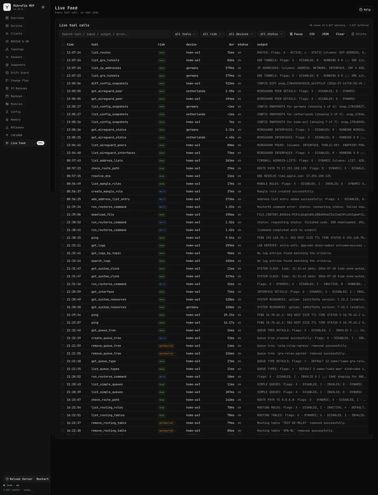
</div>

<div align="center">
  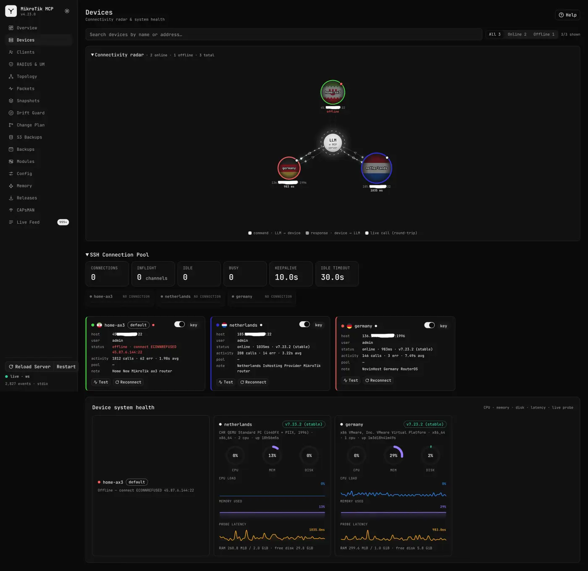
</div>

It also carries a page per flagship workflow — **Attacks** (live incidents, the evidence
behind each, guarded blocking), **Schedules** (audit posture over time and what regressed),
**Explain** (the architecture document with its topology diagram), **Policies**,
**Simulator**, **Transactions**, **Flows** and **Rollout** — plus **Config Studio** (edit
the config JSON with autocomplete + safe-apply auto-rollback), a **live topology map** from
MNDP discovery, a **releases/upgrade** timeline, and a **reload/restart** button. Everything persists to a Bun-native SQLite
store on your machine — no external database. Binds to loopback (`127.0.0.1`) by default;
set a bearer token (`--dashboard-token`) to expose it safely.

<details>
<summary><b>📸 Every dashboard screen (14 screenshots)</b></summary>

<br/>

**Live feed — call detail drawer.** One call expanded: arguments, output, target device,
duration, risk annotation — secrets already `«redacted»`.

<div align="center">
  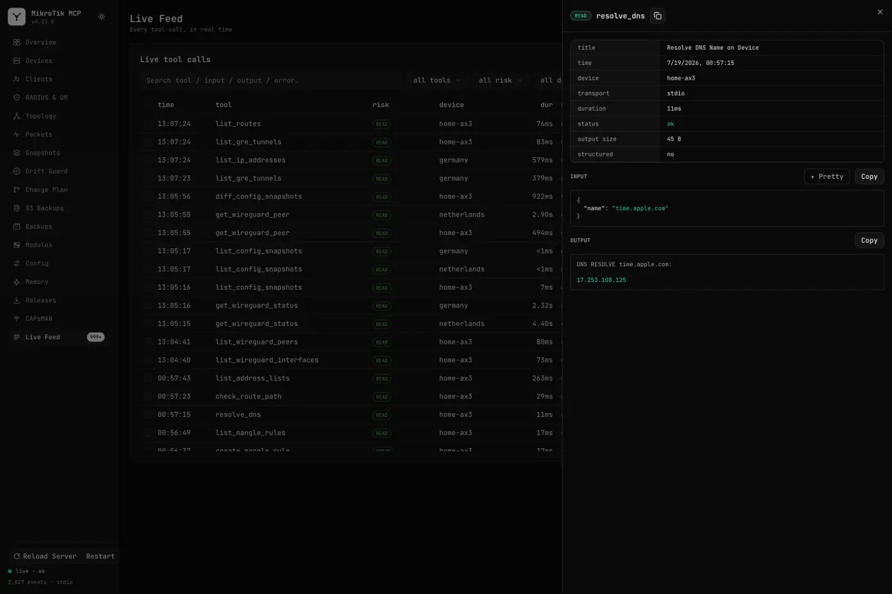
</div>

**Clients.** Every DHCP lease / connected station across devices, with identity, traffic
and last-seen.

<div align="center">
  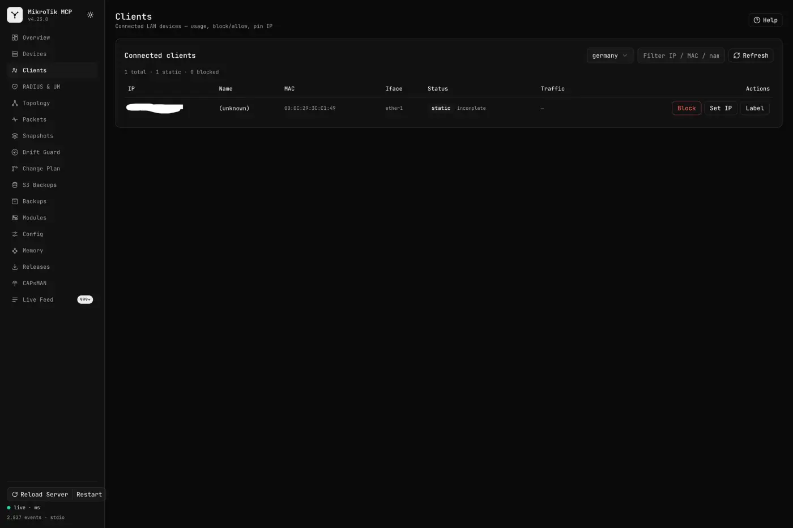
</div>

**RADIUS & User Manager.** Servers, sessions, profiles, limitations and vouchers.

<div align="center">
  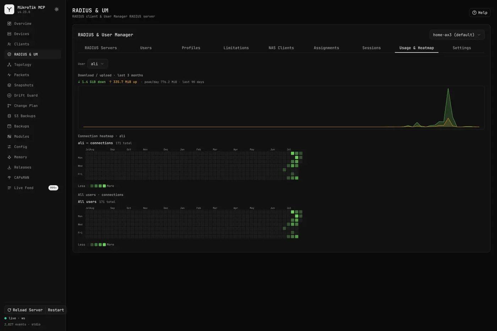
</div>

**Topology.** Live L2 map built from MNDP neighbour discovery.

<div align="center">
  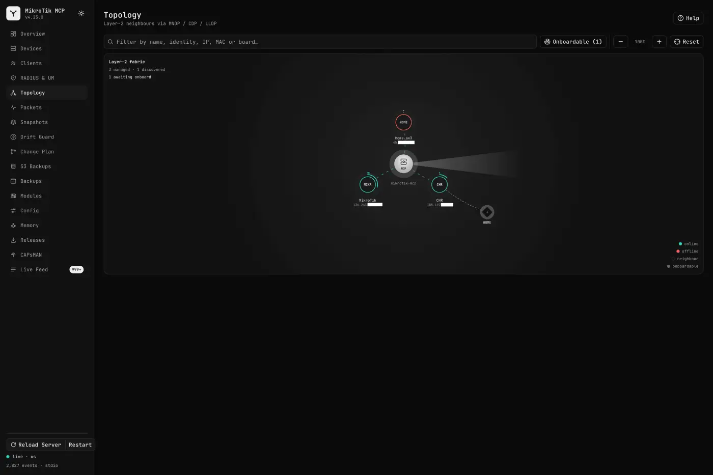
</div>

**Packets.** Packet captures started from the dashboard, with status and download.

<div align="center">
  
</div>

**Snapshots.** `/export`-based config snapshots kept locally — browse and diff any two.

<div align="center">
  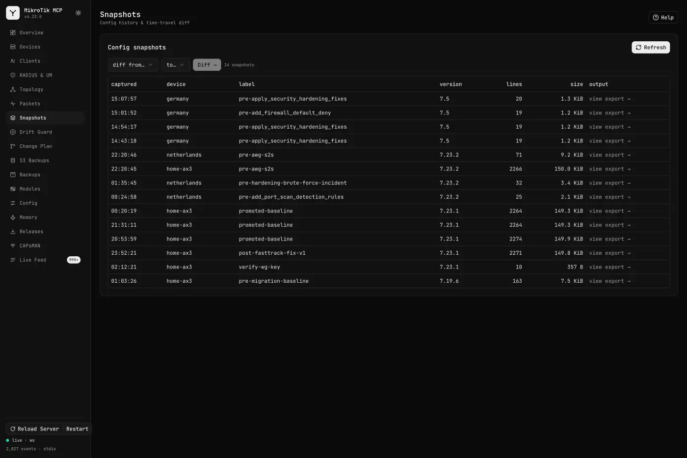
</div>

**Drift Guard.** Baseline vs. live config, with drift promoted or reconciled.

<div align="center">
  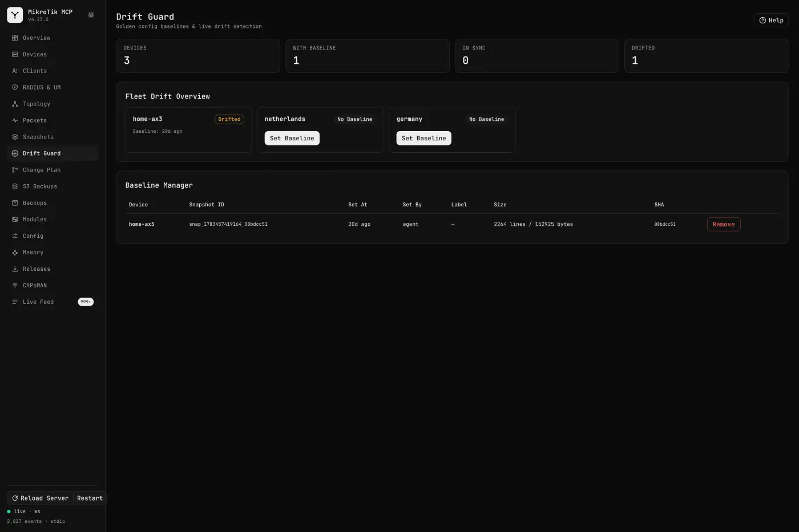
</div>

**Change Plan.** Dry-run a batch of changes, review the exact commands, then apply under
Safe Mode.

<div align="center">
  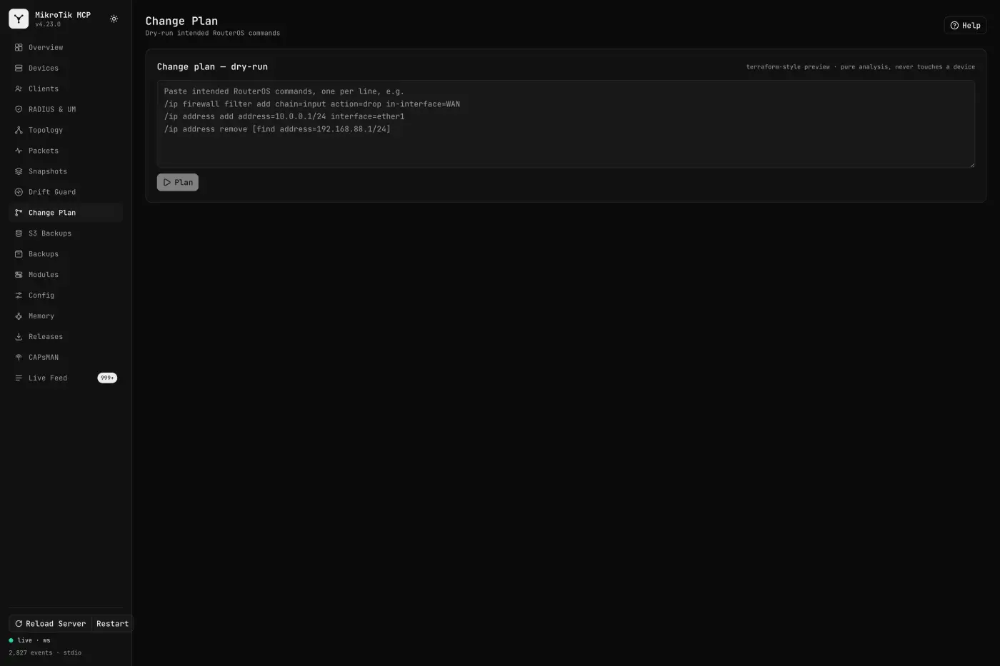
</div>

**S3 Backups.** Off-device backup archive — upload, list, download, delete.

<div align="center">
  
</div>

**Backups.** Local backup files kept on the MCP host.

<div align="center">
  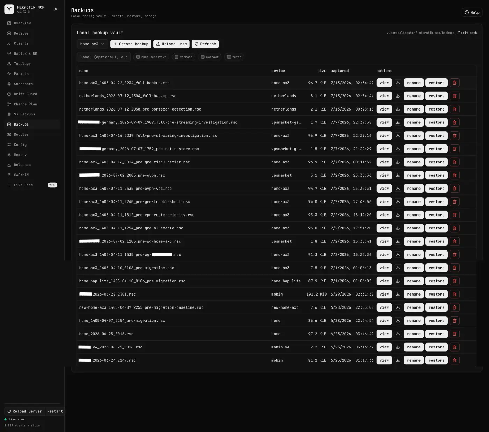
</div>

**Modules.** The full tool catalog by module and risk annotation.

<div align="center">
  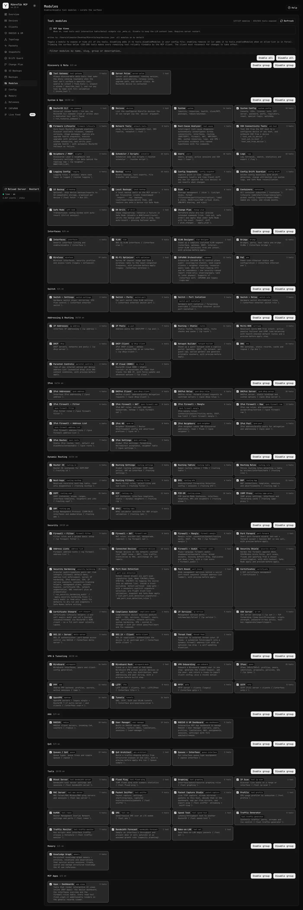
</div>

**Config.** Config Studio — edit the config JSON with autocomplete, then safe-apply with
auto-rollback.

<div align="center">
  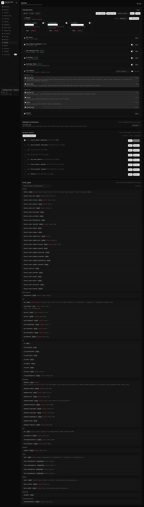
</div>

**Memory.** Knowledge graph of entities, relations and observations gathered from calls.

<div align="center">
  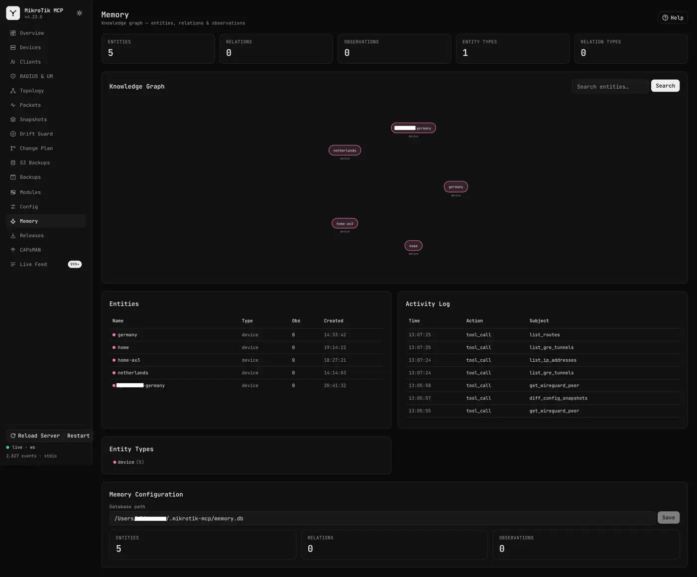
</div>

**What's new.** Release notes for the running server version, shown on first launch after
an upgrade.

<div align="center">
  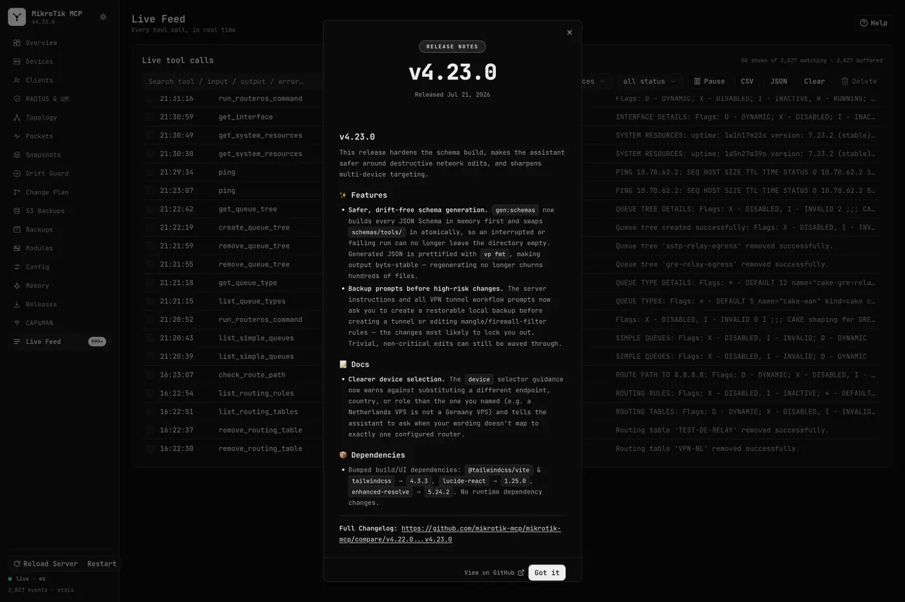
</div>

</details>

Full reference: **[docs/observability.md](docs/observability.md)**.

## The tool catalog

**885 tools across 137 modules.** Full, always-current reference (parameters + risk per
tool) is generated from source: **[docs/tools-reference.md](docs/tools-reference.md)**.

| Group                    | Tools | Modules                                                                                                           |
| ------------------------ | ----: | ----------------------------------------------------------------------------------------------------------------- |
| **System & Ops**         |   182 | system, network tools, scheduler/scripts, users, logs, backup, Safe Mode, transactions, rollout, scheduled audits |
| **Security**             |   125 | firewall filter, NAT, address-lists, certificates, IP services, hardening, policy-as-code, attack detection       |
| **VPN & Tunneling**      |   108 | WireGuard, IPsec, PPP, L2TP, PPTP, SSTP, OpenVPN, GRE/IPIP/EoIP/VXLAN                                             |
| **Dynamic Routing**      |    99 | router-id, tables, rules, next-hops, filters, BFD, BGP, OSPF, RIP, PIM-SM, IGMP proxy, GMP, RPKI                  |
| **IPv6**                 |    90 | addressing, DHCPv6, ND, neighbours, pools, routes, firewall filter/NAT/mangle/raw                                 |
| **Tools**                |    67 | ping, traceroute, bandwidth test, sniffer, traffic generator, RoMON, Wake-on-LAN, SMS                             |
| **Addressing & Routing** |    62 | IP addresses, IP pools, routing, DHCP, DNS                                                                        |
| **Interfaces**           |    56 | interfaces, VLAN, bridge, wireless, PoE                                                                           |
| **AAA**                  |    34 | RADIUS, User Manager, 802.1X                                                                                      |
| **QoS**                  |    23 | queue types, queue trees, simple queues                                                                           |
| **Switch**               |    18 | switch settings, ports, rules, port isolation                                                                     |
| **Discovery & Meta**     |     9 | tool gateway (find/describe/invoke), server pulse, capability probe                                               |
| **Memory**               |     9 | persistent knowledge graph                                                                                        |

## Beyond the catalog

Higher-level workflows built on top of the per-scope tools:

- **[Change Plan & Dry-Run](docs/change-plan.md)** — preview commands as a
  terraform-style plan, apply under Safe Mode, show the exact `/export` diff, commit
  only if still reachable.
- **[Cross-Device Transactions](docs/transactions.md)** — coordinate Safe Mode across
  several routers: prepare, verify while still uncommitted, then commit everywhere or
  roll back everywhere.
- **[Staged Fleet Rollout](docs/fleet-rollout.md)** — apply one change as canary → wave →
  fleet with a health gate and soak between waves, reverting everything already changed
  on the first failure.
- **[Scheduled Audits](docs/scheduled-audits.md)** — run the auditors on a cron with
  nobody in the loop and alert only on what changed since the previous run: new,
  worsened, resolved.
- **[Config Narrative](docs/config-narrative.md)** — turn a router's configuration into a
  plain-language architecture document with a topology diagram, and explain what the
  difference between two snapshots actually means.
- **[Attack Detection](docs/attack-detection.md)** — watch the fleet's logs for brute
  force, credential spraying and a login that succeeded after failures, correlate them
  into incidents with evidence, and block the source reversibly when you ask.
- **[Config Snapshots](docs/config-snapshots.md)** — store `/export` snapshots and
  time-travel diff any two, or one against the live device.
- **[Firewall Audit](docs/firewall-audit.md)** — find shadowed, broad, missing-default-drop,
  duplicate and dead rules, risk-scored, with one-click fixes.
- **[Security Hardening](docs/security-hardening.md)** — per-category audit+remediate
  pairs; audits read-only, fixes dry-run + snapshot + Safe-Mode first.
- **[Policy-as-Code](docs/policy-as-code.md)** — write your own compliance rules in
  YAML and lint a config snapshot offline; Markdown/JSON/SARIF, read-only, CI-able.
- **[Offline Simulator](docs/simulator.md)** — trace a hypothetical packet through NAT,
  routing and firewall against a snapshot; reports UNKNOWN rather than guessing.
- **[Traffic Flow](docs/traffic-flow.md)** — NetFlow/IPFIX collection and continuous
  top-talker / conversation / application analytics; flow metadata only, no payload.
- **[Port-Scan Detection](docs/port-scan-detection.md)** · **[Packet Capture Studio](docs/packet-capture.md)** ·
  **[Discovery](docs/discovery.md)** · **[Config Studio](docs/config-studio.md)**.

## Built-in prompts

MCP **prompts** are one-click guided workflows — authored as Markdown in
[`prompts/`](prompts/), so you can edit or add your own without touching code:

`harden-router` · `diagnose-connectivity` · `setup-guest-wifi` ·
`choose-vpn-solution` · `setup-wireguard-vpn` · `setup-ipsec-site-to-site` ·
`setup-l2tp-ipsec-roadwarrior` · `setup-tunnel-between-sites` · `backup-and-document`

See **[docs/prompts.md](docs/prompts.md)**.

## Transports

| Transport           | When                              | Run                                                              |
| ------------------- | --------------------------------- | ---------------------------------------------------------------- |
| **stdio** (default) | Claude Desktop, local MCP clients | `mikrotik-mcp serve`                                             |
| **streamable-http** | Remote / shared, behind a proxy   | `mikrotik-mcp serve --transport streamable-http --mcp-port 8000` |
| **sse**             | Legacy HTTP clients               | `mikrotik-mcp serve --transport sse`                             |

HTTP transports expose `POST /mcp` and `GET /health` with DNS-rebinding protection. See
**[docs/transports.md](docs/transports.md)**.

## Configuration

Settings come from `MIKROTIK_*` env vars or matching CLI flags (defaults → env → flags):

| Variable                      | Flag               | Default     | Purpose                             |
| ----------------------------- | ------------------ | ----------- | ----------------------------------- |
| `MIKROTIK_HOST`               | `--host`           | `127.0.0.1` | RouterOS host                       |
| `MIKROTIK_USERNAME`           | `--username`       | `admin`     | SSH user                            |
| `MIKROTIK_PASSWORD`           | `--password`       | —           | SSH password _(or use a key →)_     |
| `MIKROTIK_KEY_FILENAME`       | `--key-filename`   | —           | SSH private-key file path           |
| `MIKROTIK_KEY_PASSPHRASE`     | `--key-passphrase` | —           | Passphrase for an encrypted key     |
| `MIKROTIK_JUMP_HOST`          | `--jump-host`      | —           | SSH bastion to tunnel through       |
| `MIKROTIK_CONFIG_FILE`        | `--config`         | —           | JSON file of named devices          |
| `MIKROTIK_DEVICES`            | `--devices`        | —           | Inline JSON of named devices        |
| `MIKROTIK_MCP__TRANSPORT`     | `--transport`      | `stdio`     | `stdio` / `streamable-http` / `sse` |
| `MIKROTIK_SSH__KEEP_ALIVE`    | `--ssh-keep-alive` | `true`      | SSH connection pooling              |
| `MIKROTIK_DASHBOARD__ENABLED` | `--dashboard`      | `false`     | Real-time observability dashboard   |

Full table (HTTP host, allow-lists, timeouts, dashboard options, `MIKROTIK_LOG_LEVEL`):
**[docs/configuration.md](docs/configuration.md)**.

## Documentation

| Doc                                                                 |                                                              |
| ------------------------------------------------------------------- | ------------------------------------------------------------ |
| [Getting started](docs/getting-started.md)                          | Install, verify, first run                                   |
| [Configuration](docs/configuration.md)                              | Every env var & flag                                         |
| [Device capabilities](docs/capabilities.md)                         | What a router supports; how tools are gated on it            |
| [Alerting](docs/alerting.md)                                        | Rules that reach out — Slack, Discord, ntfy, webhook, MCP    |
| [Multiple devices](docs/multi-device.md)                            | Manage several routers; per-call targeting                   |
| [Connecting clients](docs/connecting-clients.md)                    | Claude Desktop, stdio, HTTP                                  |
| **[Observability](docs/observability.md)**                          | Real-time dashboard: live feed + analytics, SQLite           |
| [Safe Mode](docs/safe-mode.md)                                      | Transactional changes                                        |
| **[Cross-Device Transactions](docs/transactions.md)**               | Two-phase commit across several routers                      |
| **[Staged Fleet Rollout](docs/fleet-rollout.md)**                   | Canary → wave → fleet with health gates and auto-revert      |
| **[Change Plan & Dry-Run](docs/change-plan.md)**                    | Preview commands, apply with the exact diff + auto-rollback  |
| **[Traffic Flow](docs/traffic-flow.md)**                            | NetFlow/IPFIX collection + top-talker analytics              |
| **[Attack Detection](docs/attack-detection.md)**                    | Live attack incidents from logs; guarded, timed blocking     |
| **[Firewall Audit](docs/firewall-audit.md)**                        | Shadowed/broad/dead rules, risk-scored                       |
| **[Security Hardening](docs/security-hardening.md)**                | Per-category audit+remediate, snapshot + Safe-Mode           |
| **[Scheduled Audits](docs/scheduled-audits.md)**                    | Auditors on a cron, alerting only on run-over-run changes    |
| **[Policy-as-Code](docs/policy-as-code.md)**                        | Your own YAML compliance rules, linted offline → SARIF       |
| **[Config Narrative](docs/config-narrative.md)**                    | Config → architecture doc + Mermaid; consequence-level diffs |
| **[Offline Simulator](docs/simulator.md)**                          | Trace a packet through firewall + routing, no device         |
| **[VPN guide](docs/vpn-guide.md)**                                  | Every tunnel type + how to build it                          |
| [Prompts](docs/prompts.md)                                          | The 9 guided workflows                                       |
| [Architecture](docs/architecture.md) · [Security](docs/security.md) | How it's built · credentials & risk gating                   |
| [Tool reference](docs/tools-reference.md)                           | The full generated catalog                                   |
| [Development](docs/development.md) · [Docker](docs/docker.md)       | Build, test, deploy                                          |

## Security

Talks to RouterOS over SSH using credentials you supply; nothing is sent anywhere else.
Tool values are quoted/escaped to prevent console-command injection. Destructive tools
are annotated so clients can require confirmation. Details:
**[docs/security.md](docs/security.md)**. Only point this at devices you're authorized to manage.

## License

[MIT](LICENSE). Reuse freely. No warranty.

---

<div align="center">
  <br/>
  Made with ❤️ by <a href="https://github.com/ali-master">Ali Torki</a>
</div>
