<div align="center">
  
  <p><strong>Drive one or more MikroTik routers in plain language — 950 risk-annotated tools your AI can call, over SSH.</strong><br/>
  Firewall · routing · DHCP/DNS · wireless · QoS · a complete VPN suite · transactional Safe Mode · live attack detection · and an observability dashboard that watches every call.</p>

  <p>
    <a href="LICENSE"></a>
    
    
    
    <a href="docs/"></a>
  </p>
</div>

---

`@usex/mikrotik-mcp` turns **MikroTik RouterOS** into **924 [Model Context Protocol](https://modelcontextprotocol.io)
tools** any MCP client (Claude Desktop, Claude Code, Cursor, …) can call to read and
configure your router by talking to it. It reaches the device over **plain SSH** — no
agent, no package to install on RouterOS — runs on **[Bun](https://bun.sh)**, and
validates every call against a schema.

Point it at a router and go:

```jsonc
// claude_desktop_config.json
{
  "mcpServers": {
    "mikrotik": {
      "command": "mikrotik-mcp",
      "env": {
        "MIKROTIK_HOST": "192.168.88.1",
        "MIKROTIK_USERNAME": "admin",
        "MIKROTIK_PASSWORD": "your-password",
      },
    },
  },
}
```

Then just ask:

> _"Show me the firewall input chain, then block SSH from the WAN under safe mode."_
> _"Build an IKEv2 site-to-site tunnel to 203.0.113.5 for 192.168.20.0/24."_
> _"Why can't VLAN 50 reach the internet?"_

## Highlights

- **IP Intelligence:** `lookup_ip_intelligence` and Diagnostics → IP Intelligence compare full ipquery/ipkit responses: ASN/organization, location, risk and every additional field, with searchable details and JSON export. Public IPs are sent only on submission; private IPs stay local. [Guide](docs/ip-intelligence.md).
- **Service probes:** add, edit, search and remove approved HTTPS/TLS/TCP/DNS targets directly in Config or Service Routing, with explicit IP/CIDR boundaries and safe-apply confirmation. [Setup guide](docs/service-contracts.md#dashboard-setup-no-json-required).
- **OpenVPN connections:** active users, source/tunnel IPs, cached country flags and ASN organizations, searchable source networks and live connection time, with confirmed single-session disconnect and read-only access controls. [Guide](docs/openvpn-connections.md).
- **Service Routing:** live IPv4/IPv6 routes, fuzzy address-list search, exact/wildcard domain-to-exit policies with optional health probes, per-policy live matched-traffic counters and charts, VRF HTTPS exit checks and
  explicitly authorized failover, with preview, backup and Safe Mode. [Guide](docs/service-routing.md)
- **Flight Recorder:** opt-in, durable pre/post-incident telemetry and log metadata,
  with an evidence timeline and scoped JSON export. [Guide](docs/flight-recorder.md)
- **Recovery Lab:** reviewed portable restore/upgrade rehearsals, coverage and cleanup
  evidence. Execution requires a separately deployed isolated CHR runner. [Guide](docs/recovery-lab.md)

- **Client Check** — invite the affected phone/laptop with an expiring QR/link,
  measure browser HTTP latency, loaded latency and bounded transfers, and compare
  Wi-Fi/VPN runs in the dashboard. Optional investigation links keep evidence together.
  Tests measure the path **to the MCP host**, not arbitrary internet speed, DNS leakage
  or PMTU. [Guide and trust boundary](docs/network-workspaces.md#client-check)
- **Router Migration** — inspect both routers, map Ethernet ports, preview supported
  configuration and review omitted sections. Fresh-state checks, local snapshots of
  both routers, Safe Mode rehearsal and verified **inactive staging** protect the
  target. Physical cutover, credentials and activation remain operator-controlled.
  [Supported scope](docs/network-workspaces.md#router-migration)
- **Support Bundles** — prepare a time-bounded report from saved investigations,
  event metadata, snapshot inventories and client measurements. Raw tool bodies,
  secrets and personal labels stay out; network identifiers become consistent aliases.
  Review before downloading self-contained HTML or JSON. Nothing is uploaded.
  [Privacy and export](docs/network-workspaces.md#support-bundles)
- **MCP App workspaces** — 13 host-themed views, with dedicated investigation,
  round-trip, service-health, L2 fabric, operations and report workspaces alongside
  the existing device, interface, firewall and record views. Responsive grids,
  named path interfaces, expandable evidence and colored JSON keep results readable
  inside compatible MCP clients. New report views never execute or replay tools.
  [View guide](docs/mcp-app-workspaces.md)
- **Round-trip path lab** — model explicit forward/reverse static IPv4 paths across
  fresh snapshots, with per-hop evidence and declared asymmetry. NAT or unsupported
  state stops with UNKNOWN; modelled forwarding is not live connectivity.
  A guided three-step editor selects routers, dated captures and interfaces without
  writing JSON, with an optional mirrored return path and plain-language result labels.
  [Guide](docs/round-trip-paths.md)
- **Service health contracts** — approved DNS/TCP/TLS/HTTPS endpoint checks from the
  MCP host, optional fresh-export packet regressions, historical evidence, explicit
  scheduled enrollment and fail-closed rollout gates. Disabled until targets are
  approved. [Guide](docs/service-contracts.md)
- **Client/service investigations** — save multi-router DHCP/ARP/bridge and network
  evidence with timestamps, explicit unknowns and next experiments. Router ICMP
  success never masquerades as verified application health.
  [Guide](docs/client-investigations.md) · [Delivery tracker](docs/enterprise-roadmap.md)
- **Exported client-flow paths** — select a recent TCP/UDP flow and visualize its
  reported ingress/exit, with named VPN-interface lookup and colored JSON evidence.
  Uses existing NetFlow/IPFIX exports; never enables capture or changes router settings.
  Missing telemetry remains unknown, not a fabricated blocking hop.
  [Flow-path guide](docs/client-flow-paths.md)
- 🧰 **924 tools, one per RouterOS scope** — L2 (bridge, VLAN, wireless, PoE),
  L3 (addressing, routing, DHCP, DNS), security (firewall, NAT, address-lists,
  certificates), QoS, and system ops (users, logs, backups, scheduler).
- 🛡️ **Attack detection** — reads every device's log, correlates brute force,
  credential spraying and _a login that succeeded after failures_ into incidents with
  evidence, and can block the source with a timed, reversible entry. Detect-only until
  you say otherwise. [→](docs/attack-detection.md)
- ⏱️ **Scheduled audits** — run the auditors on a cron with nobody in the loop, and
  hear only about what **changed** since the last run: new, worsened, resolved.
  [→](docs/scheduled-audits.md)
- 📖 **`explain_device`** — turns a config into the architecture document that should
  have been in the wiki (topology diagram, what's exposed, what each chain does), and
  explains what the difference between two snapshots actually _means_.
  [→](docs/config-narrative.md)
- 🧪 **Offline simulator** — trace a hypothetical packet through NAT, routing and
  firewall against a snapshot, with no device in the loop. Reports UNKNOWN rather than
  guessing. [→](docs/simulator.md)
- 📊 **Live observability dashboard** — a localhost web UI that shows **every tool
  call the AI makes** in real time: inputs, outputs, latency, errors, per-device
  analytics. Secrets redacted. [Jump to it ↓](#-observability-dashboard)
- 🔐 **Complete VPN suite** — WireGuard, IPsec (IKEv1/IKEv2), L2TP, PPTP, SSTP,
  OpenVPN, plus GRE/IPIP/EoIP/VXLAN. A `choose-vpn-solution` prompt picks one for you.
- 🛟 **Safe Mode** — wrap risky changes in a real transactional window; RouterOS
  holds them in memory and **auto-reverts if your session drops**, so you can't lock
  yourself out.
- 🚦 **Risk-annotated** — every tool is tagged read / write / destructive, so clients
  auto-approve reads and prompt on writes.
- 🧱 **Injection-safe** — a command builder quotes/escapes every value; a hostname
  like `LAN; /system reset` can never split into a second command.
- 🖧 **Multiple devices** — name your routers and target one per call; configure
  **both ends of a tunnel** in one conversation.
- 🪜 **SSH jump hosts** — reach a router with no exposed port by tunnelling through a
  bastion (`jumpVia`); commands, Safe Mode and file upload all ride the hop.
- ⚡ **Connection pooling** — one persistent SSH session per device saves ~200-500 ms
  per command.
- 🔀 **REST API, opt-in** — point a device at RouterOS 7.9+'s `/rest` for structured
  JSON and real HTTP status codes, with automatic SSH fallback for anything REST
  can't express. Per-device, off by default.

## Install

```bash
# Requires Bun ≥ 1.3 — https://bun.sh
bun add -g @usex/mikrotik-mcp

# Point it at your router and verify SSH connectivity
MIKROTIK_HOST=192.168.88.1 MIKROTIK_USERNAME=admin MIKROTIK_PASSWORD=•••• \
  mikrotik-mcp auth-check

# Wire it into your MCP client (stdio by default)
mikrotik-mcp serve
```

Prefer **SSH keys**? Swap the password for a key file (add a passphrase if it's encrypted):

```bash
MIKROTIK_HOST=192.168.88.1 MIKROTIK_USERNAME=admin \
MIKROTIK_KEY_FILENAME=~/.ssh/id_ed25519 \
MIKROTIK_KEY_PASSPHRASE=•••• \
  mikrotik-mcp auth-check     # prints "Auth mode: SSH key"
```

Prefer a **one-click bundle** (no Bun/Node/npm on the machine, credentials entered in
the host UI)? Build an `.mcpb` and drag it into Claude Desktop → Settings → Extensions:

```bash
bun run build:mcp                    # bundle for this machine
bun run build:mcp --target linux-x64 # or one target · build:mcp:all for every target
```

Full options: **[docs/configuration.md](docs/configuration.md)** · MCPB details:
**[docs/getting-started.md](docs/getting-started.md)**.

## Simple usage — by scenario

Once the server is wired into your client, everything below is a **plain-language
request**. The AI picks the right tool, validates it, and runs it. No CLI syntax to memorize.

### 🔎 See what's on the router

> _"List the firewall filter rules and flag anything that allows WAN → LAN."_
> _"What DHCP leases are active right now?"_
> _"Show interface traffic and tell me which port is saturated."_

All read-only — safe to auto-approve.

### 🧱 Make a change, safely

> _"Enable safe mode, block inbound SSH on the WAN, then commit if I'm still connected."_

Safe Mode holds the change in memory and reverts automatically if you lock yourself out:

```text
enable_safe_mode → (make changes) → commit_safe_mode    # persist
                                   → rollback_safe_mode  # discard
```

### 🔐 Stand up a VPN

> _"Create a WireGuard interface on port 13231 and generate a client config for my laptop."_
> _"Build an IKEv2 site-to-site tunnel to 203.0.113.5 for 192.168.20.0/24."_

Not sure which VPN? Ask the **`choose-vpn-solution`** prompt — it recommends one and
outlines the build. Every technology is covered:

| Need                                | Use                     | Build it with                                                                          |
| ----------------------------------- | ----------------------- | -------------------------------------------------------------------------------------- |
| MikroTik ↔ MikroTik, modern clients | **WireGuard**           | `create_wireguard_interface`, `add_wireguard_peer`, `generate_wireguard_client_config` |
| Interop site-to-site / native IKEv2 | **IPsec**               | `create_ipsec_{profile,peer,identity,proposal,policy}`, `get_ipsec_active_peers`       |
| Built-in OS VPN clients             | **L2TP/IPsec**          | `set_l2tp_server`, `create_ppp_secret`, `create_ppp_profile`                           |
| Through restrictive firewalls       | **SSTP** (TLS)          | `set_sstp_server`, `create_sstp_client`                                                |
| Cross-platform                      | **OpenVPN**             | `set_ovpn_server`, `create_ovpn_client`                                                |
| Route / L2-bridge between sites     | **GRE/IPIP/EoIP/VXLAN** | `create_gre_tunnel`, `create_eoip_tunnel`, `create_vxlan_tunnel`                       |

Details: **[docs/vpn-guide.md](docs/vpn-guide.md)**.

### 🖧 Manage several routers at once

Name your routers and drive them all from one conversation — exactly what you need to
**set up a tunnel between two MikroTiks and test it from both ends**:

```jsonc
// devices.json
{
  "defaultDevice": "site-a",
  "devices": {
    "site-a": { "host": "203.0.113.10", "username": "admin", "keyFilename": "/keys/site-a" },
    "site-b": { "host": "198.51.100.20", "username": "admin", "password": "••••" },
  },
}
```

```bash
mikrotik-mcp serve --config ./devices.json
mikrotik-mcp devices        # site-a (default) · site-b
```

#### Docker: one writable `devices.json` for all MCP settings

Use the published **[alimaster/mikrotik-mcp](https://hub.docker.com/r/alimaster/mikrotik-mcp)**
image (`6.1.0`, or the moving `latest` tag). Docker selects `linux/amd64` or
`linux/arm64` automatically; no local build is needed. Compose defaults to
`6.1.0`; set `MIKROTIK_IMAGE_TAG` explicitly to select a different release.

**Not ARM-only:** the same image runs on x86-64 and ARM64 Linux hosts (including
Ubuntu), and on Windows/macOS through Docker Desktop's **Linux containers**.
Windows users should enable the WSL2 backend; do not select Windows containers.
See the [host compatibility and PowerShell quick start](docs/docker.md#host-compatibility)
for platform-specific setup. Neither Compose nor the runtime is pinned to ARM.

The Bun container reads **`/home/bun/.mikrotik-mcp/devices.json`** automatically.
Despite its name, this is the **complete MCP configuration**, not just the router
list: `mcp`, `dashboard`, `ssh`, `memory`, `tools`, `access`, `alerts`, `flows`,
`policy`, `schedules`, `attacks`, `serviceProbes`, `s3` and top-level settings live
in this same JSON. Config/Devices saves and MCP settings tools write back to it;
confirm **Keep changes** (or `confirm_mcp_settings`) before restarting a pending
safe-apply transaction. Listener/transport changes require a server restart.

Create a real JSON file on the host (no comments or trailing commas). For example:

```json
{
  "defaultDevice": "home",
  "devices": {
    "home": {
      "host": "192.168.88.1",
      "username": "automation",
      "keyFilename": "/run/secrets/mikrotik_key"
    }
  },
  "mcp": { "transport": "streamable-http", "host": "0.0.0.0", "port": 8000 },
  "dashboard": { "enabled": true, "host": "0.0.0.0", "port": 9090 },
  "ssh": { "keepAlive": true },
  "memory": { "enabled": true },
  "disableUpdateCheck": true
}
```

```bash
docker pull alimaster/mikrotik-mcp:6.1.0
docker run -d --name mikrotik-mcp --restart unless-stopped \
  -p 127.0.0.1:8000:8000 -p 127.0.0.1:9090:9090 \
  --mount type=volume,src=mikrotik-state,dst=/home/bun/.mikrotik-mcp \
  --mount type=bind,src=/absolute/path/devices.json,dst=/home/bun/.mikrotik-mcp/devices.json \
  --mount type=bind,src=/absolute/path/mikrotik_ed25519,dst=/run/secrets/mikrotik_key,readonly \
  alimaster/mikrotik-mcp:6.1.0
```

Dashboard: **http://localhost:9090** · MCP: **http://localhost:8000/mcp**.
The JSON mount must be **read-write**, must already exist, and must be readable
and writable by container **UID/GID 1000**. Keep it private (`0600`); it can contain
credentials. The SSH key only needs read access. On Linux, arrange matching
ownership/ACLs; do not make secrets world-readable. Mount a dedicated copy rather
than sharing the live service's file with a second writer.

The included Compose file binds `./devices.json` (or the absolute path in
`MIKROTIK_CONFIG_PATH`) and also persists application data:

```bash
# Only creates a starter file when none exists; edit it before starting.
test -e devices.json || cp docker/devices.example.json devices.json
# Configure devices + dashboard.enabled in devices.json; mount your key in Compose.
docker compose pull mikrotik-mcp
docker compose up -d mikrotik-mcp
# Or use an existing file:
MIKROTIK_CONFIG_PATH=/absolute/path/devices.json docker compose up -d mikrotik-mcp
```

- The starter JSON has no credentials and leaves the dashboard disabled. Docker
  defaults are stored in JSON, so saved ports/settings are not silently replaced
  by baked-in environment defaults on restart. Explicit CLI/env overrides still
  win; remove conflicting `.env` values if JSON should be authoritative.
- If changing listener ports in JSON, update Docker's port mappings too. For
  Compose set `MCP_PORT` / `DASHBOARD_PORT` to the **same** new ports; these only
  control publishing, not application settings. Its healthcheck reads the JSON.
- The named state volume retains databases, Memory contents, reports, config
  backups and history. These are **data**, not settings, and are not embedded in
  JSON. Custom database/backup paths must also be mounted. Do not use
  `docker compose down -v` if you want to retain this data.
- For the strongest crash safety, mount a **dedicated parent directory** containing
  `devices.json` at `/home/bun/.mikrotik-mcp` instead of a single file; this preserves
  atomic replacement and all state on the host. Single-file mounts use a private,
  flushed `.bak-mounted-*` backup and an inode-preserving write when Linux rejects
  rename with `EBUSY`. That fallback is not power-loss atomic; keep one writer and
  retain backups. A read-only mount cannot persist edits. After replacing the host
  file by rename in an editor, recreate a single-file-mounted container to remount
  the new file.

See **[Docker deployment and persistence](docs/docker.md#persistent-devicesjson)**
for directory mounts, permissions and explicit configuration overrides.
Maintainers: run **`bun run docker:publish`** for the interactive Docker Hub
publisher (automatic account detection/login, release review, multi-platform push
and verified `latest` promotion). Preview safely with `bun run docker:publish --dry-run`.
See **[Publishing to Docker Hub](docs/docker-publishing.md)** for details and manual commands.

Every tool gains an optional `device` argument, and **Safe Mode is per-device**:

> _"On site-a create a WireGuard interface, on site-b add it as a peer, then ping across."_

Behind a bastion with no exposed port? Jump through another router (`jumpVia`) —
commands, Safe Mode and SFTP all ride the hop. Full guide:
**[docs/multi-device.md](docs/multi-device.md)**.

#### Multiple management addresses & automatic failover

In **Devices → Add device / Edit settings → Connection**, add internal, VPN or public static IPs
and choose **Primary**. The existing `host` is Primary; `fallbackHosts` holds up to seven
alternate IPv4/IPv6 addresses in priority order. All addresses must reach the **same router**,
using its shared SSH/REST ports, credentials and jump-host configuration.

```json
{
  "host": "10.10.10.1",
  "fallbackHosts": ["203.0.113.10", "2001:db8::10"],
  "port": 22,
  "username": "admin",
  "keyFilename": "/keys/home"
}
```

- A successful connection remembers its IP for **5 minutes**, separately for each device and
  transport/port. New connections try that IP first; each successful connection renews the window.
  Failure clears the preference immediately. Without a cached success, Primary and then alternatives
  are tried in order, with a 30-second cooldown for failed addresses. Healthy pooled/Safe Mode sessions
  stay open even after expiry; commands already dispatched are never replayed on another IP.
- Device cards automatically refresh address observations every 4 seconds: open connections,
  remembered IP and remaining preference time, last failures, and untested addresses. These are real
  connection observations, not continuous probes of unused addresses. Primary is never rewritten;
  preference is in-memory and resets on server restart or device configuration replacement.
- SSH, SSH jump devices, SFTP, initial Safe Mode setup, REST probes and dashboard tests use this
  selection. Authentication/key errors stop that connection attempt; MAC-Telnet has no IP failover.
- Device cards and `list_mikrotik_devices` distinguish **Connected**, historical success, failed
  attempts and untested addresses. **Test connection / Connect & Save** reports the IP that authenticated.
- Failover happens **before command dispatch**. A lost command response is not automatically replayed
  on another IP or over SSH. An active Safe Mode transaction never migrates between connections.
- Existing single-address configurations remain valid. No router interface, routing or firewall
  settings are changed by adding management addresses to MCP.

### 🩺 Diagnose and harden

> _"Why can't VLAN 50 reach the internet?"_
> _"Audit my firewall for shadowed and overly-broad rules."_
> _"Harden this router and show me the exact diff before committing."_

These map to higher-level workflows — [firewall audit](docs/firewall-audit.md),
[security hardening](docs/security-hardening.md), [change plan & dry-run](docs/change-plan.md) —
each read-only to inspect, dry-run + Safe Mode to fix.

## 📊 Observability dashboard

**A localhost web dashboard that watches every tool call the LLM makes against this
server — in real time.** Off by default, zero overhead until you flip it on, and it runs
alongside whatever transport you use:

```bash
mikrotik-mcp serve --dashboard          # → http://127.0.0.1:9090
```

<div align="center">
  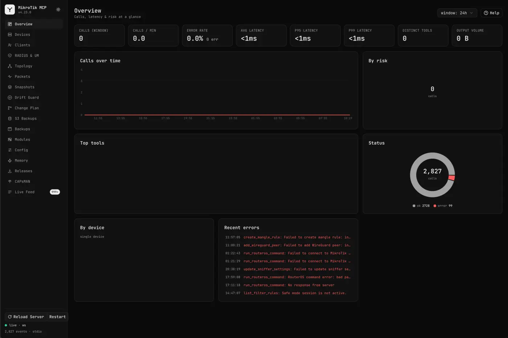
</div>

Every call flows through one choke point in the registry, so the dashboard sees **all
of them, across every transport**. Why you'll want it on:

- 👁️ **Live feed of every call** — tool, inputs, outputs, target device, duration,
  success/error — streaming in over a Bun-native WebSocket (SSE fallback). Filter by
  tool / risk / device / status / free-text, pause & resume, export to CSV or JSON.
- 📈 **Analytics at a glance** — calls in window, calls/min, error rate, avg / p95 / p99
  latency, distinct tools, output volume; top tools, by-risk and status donuts,
  by-device bars, and a recent-errors panel.
- 🔒 **Secrets redacted before storage** — any password, private key, PSK or token is
  replaced with `«redacted»` before anything is stored or streamed. Set
  `--dashboard-capture-body=false` to keep metadata only.
- 🕸️ **Devices & connectivity map** — a hub-and-spoke graph of the server to each
  device, coloured by live SSH reachability, with per-device online/offline, latency,
  RouterOS identity/version and recent activity.

<div align="center">
  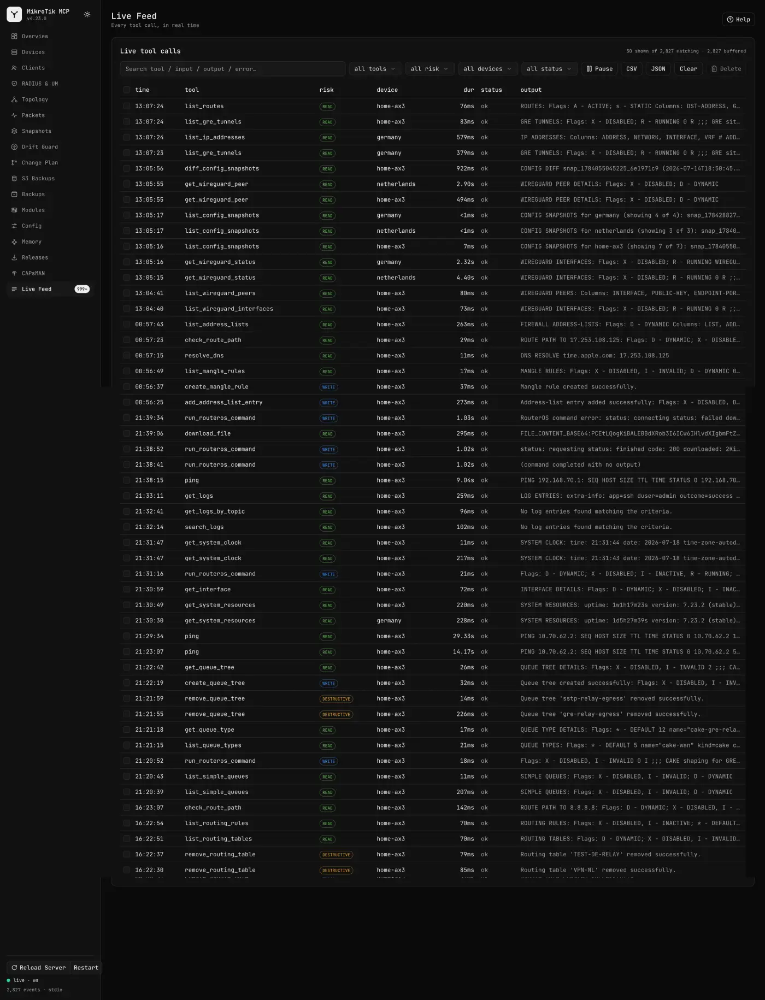
</div>

<div align="center">
  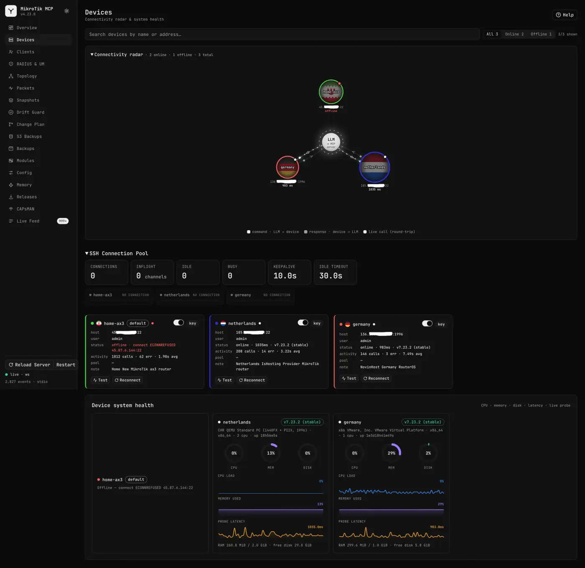
</div>

It also carries a page per flagship workflow — **Attacks** (live incidents, the evidence
behind each, guarded blocking), **Schedules** (audit posture over time and what regressed),
**Explain** (the architecture document with its topology diagram), **Policies**,
**Simulator**, **Transactions**, **Flows** and **Rollout** — plus **Config Studio** (edit
the config JSON with autocomplete + safe-apply auto-rollback), a **live topology map** from
MNDP discovery, a **releases/upgrade** timeline, and a **reload/restart** button. Everything persists to a Bun-native SQLite
store on your machine — no external database. Binds to loopback (`127.0.0.1`) by default;
set a bearer token (`--dashboard-token`) to expose it safely.

<details>
<summary><b>📸 Every dashboard screen (14 screenshots)</b></summary>

<br/>

**Live feed — call detail drawer.** One call expanded: arguments, output, target device,
duration, risk annotation — secrets already `«redacted»`.

<div align="center">
  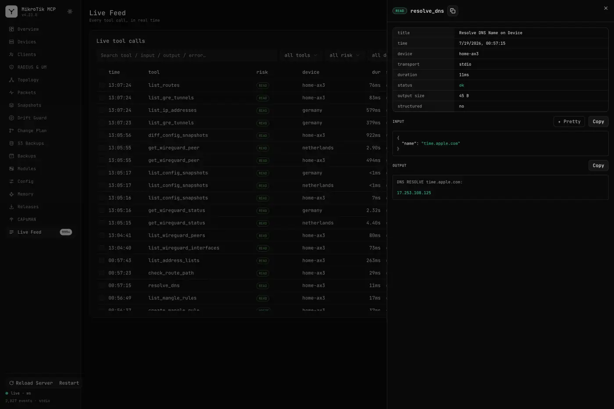
</div>

**Clients.** Every DHCP lease / connected station across devices, with identity, traffic
and last-seen.

<div align="center">
  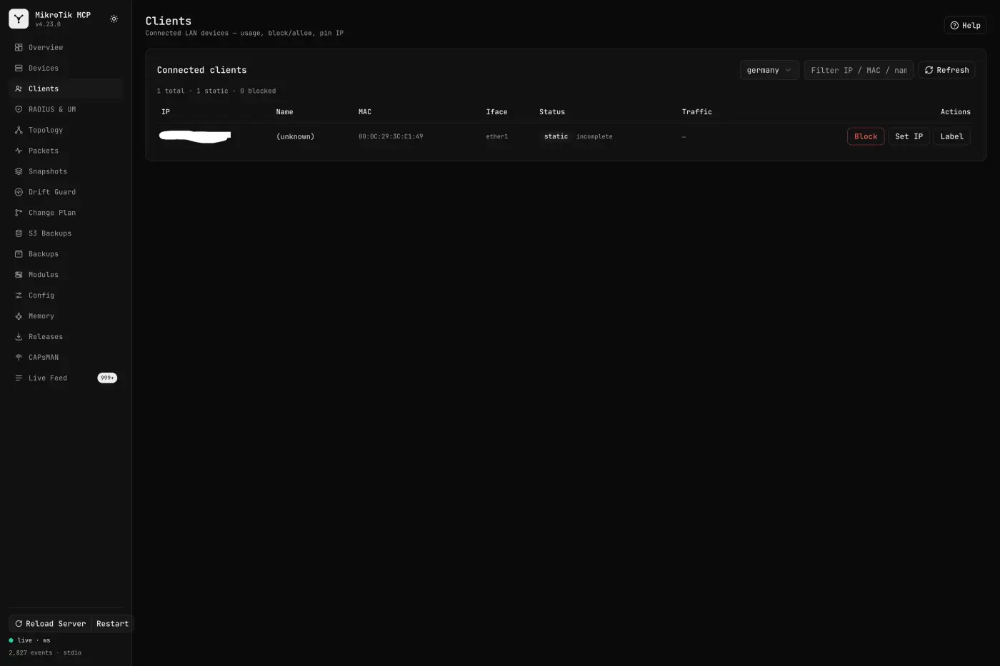
</div>

**RADIUS & User Manager.** Servers, sessions, profiles, limitations and vouchers.

The **Users** table also shows each user's last recorded connection date and time
(router-local time), using a separate background cache so traffic counters stay fast.
See [last connection reporting](docs/user-manager-last-connections.md).

In **Users → Edit → Service profile**, keep the current profile or choose another
profile on the selected router. Saving reuses an eligible assignment (or creates
one), activates it and verifies the result. Previous assignments and accounting
history are preserved; queued profiles can still take over after expiry. Existing
connections may need to reconnect to receive new limits. No session is forcibly
disconnected. If a save cannot be confirmed, check **Assignments** before retrying.

Reports & insights collects accounting in the background and shows verified-session
progress on the first visit. Complete snapshots are saved privately alongside the
dashboard database in `<dashboard.dbPath>.um-reports/` and restored after restart
(up to 24 hours old, clearly marked when stale). Device/credential/jump-host changes
invalidate the saved snapshot. Automatic refresh waits at least 60 seconds, or five
times the previous collection duration (capped at 15 minutes), to avoid repeatedly
loading large histories. **Refresh** starts a shared background read without hiding
the current report. Failed reads never replace a complete report with partial totals.
An ephemeral `:memory:` dashboard or an unwritable storage directory uses RAM only;
the report page warns when a snapshot could not be persisted.

<div align="center">
  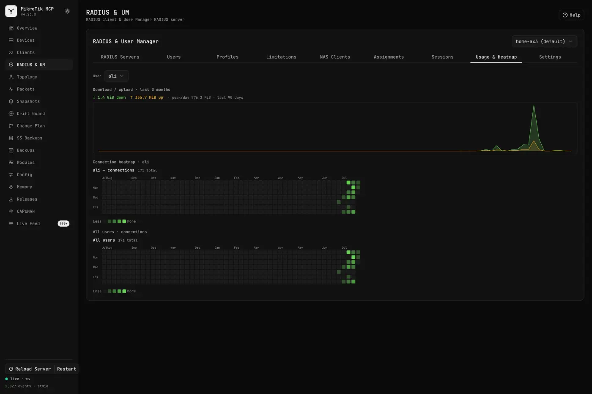
</div>

**Topology.** Live L2 map built from MNDP neighbour discovery.

<div align="center">
  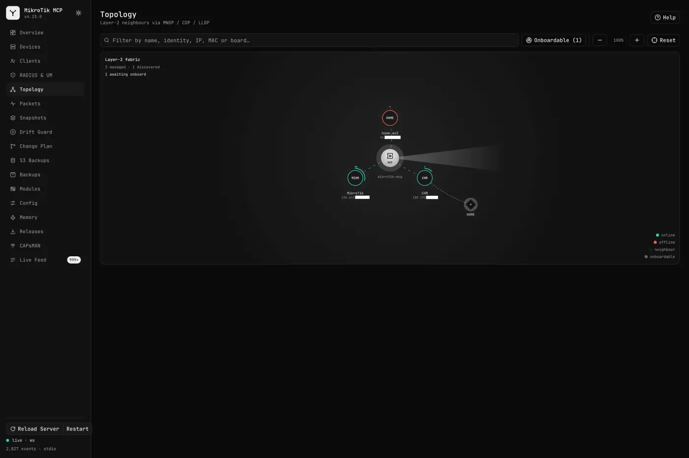
</div>

**Packets.** Packet captures started from the dashboard, with status and download.

<div align="center">
  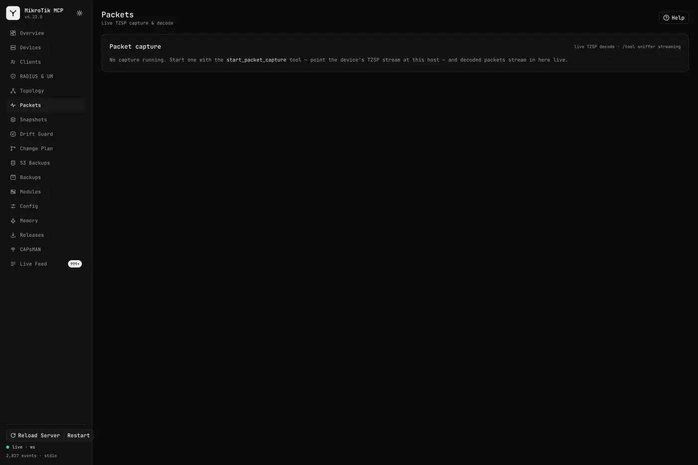
</div>

**Snapshots.** `/export`-based config snapshots kept locally — browse and diff any two.

<div align="center">
  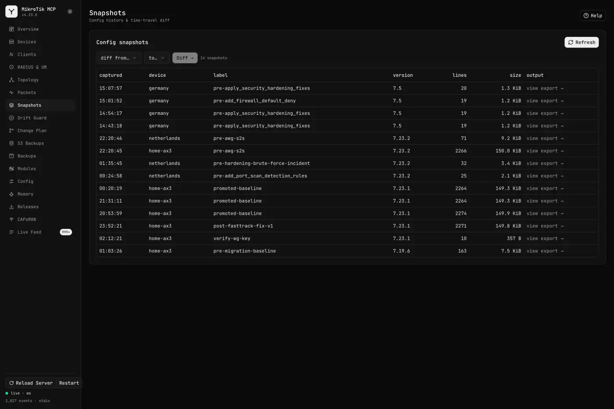
</div>

**Drift Guard.** Baseline vs. live config, with drift promoted or reconciled.

<div align="center">
  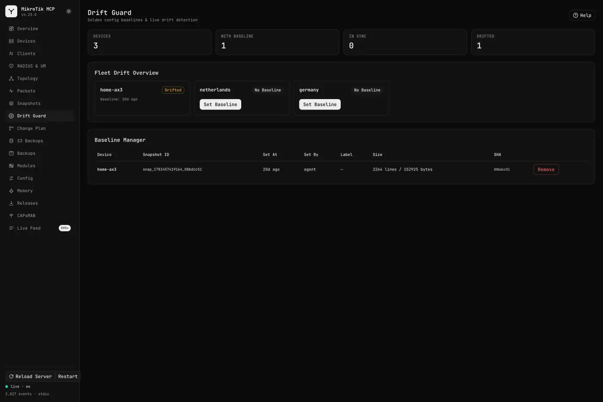
</div>

**Change Plan.** Dry-run a batch of changes, review the exact commands, then apply under
Safe Mode.

<div align="center">
  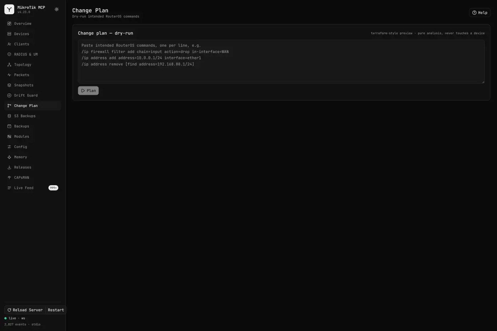
</div>

**S3 Backups.** Off-device backup archive — upload, list, download, delete.

<div align="center">
  
</div>

**Backups.** Local backup files kept on the MCP host.

<div align="center">
  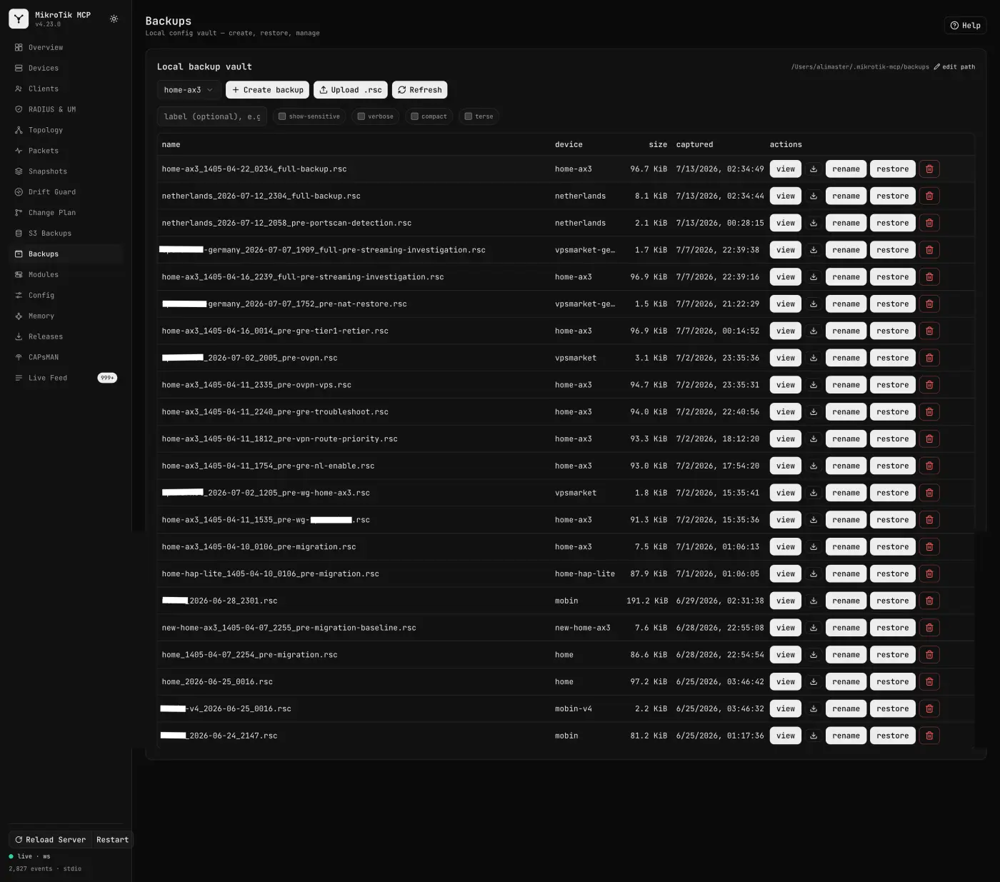
</div>

**Modules.** The full tool catalog by module and risk annotation.

<div align="center">
  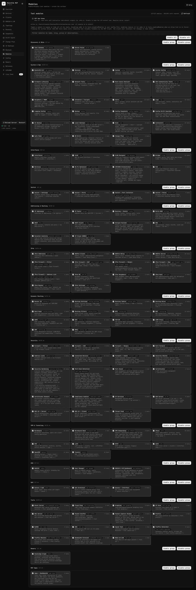
</div>

**Config.** Config Studio — edit the config JSON with autocomplete, then safe-apply with
auto-rollback.

<div align="center">
  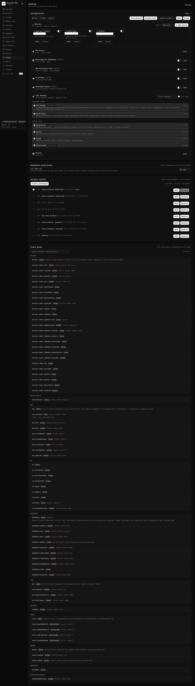
</div>

**Memory.** An evidence-aware knowledge workspace: searchable facts, constraints, lessons,
preferences and procedures, scoped to entities and their explicit relationships. Inspect
sources, author-assigned confidence, expiry, verification and revision history; pin important
knowledge, archive outdated records, and use **Recall lab** to preview the exact bounded context
an LLM receives. Search and pagination survive background refreshes.

The MCP workflow is `memory_create_entities` → `memory_remember` → `memory_recall`.
Use a stable `key` (for example `wan.provider`) to replace a fact while keeping its previous
revisions. `memory_review` finds unverified, expired, low-confidence and 90-day-old records;
`memory_revise` requires the current revision number to prevent lost edits, and
`memory_history` shows previous versions. Changing content or source clears verification.

Recall uses local SQLite full-text search (including Unicode), direct/related entity scope,
pinning and freshness signals—not an external model or embedding API. It excludes archived
and expired records, explains each selection, and respects an explicit character budget.
Confidence is supplied by the author, **not** a measured probability. Memory is untrusted
reference material, never permission to change a router; live state still needs checking.

Existing observations migrate in place as **unverified legacy knowledge**, with a standalone
`.pre-knowledge-*.bak` database snapshot made before migration. The original graph tools and
Raycast API remain compatible. Automatic recording creates device entities after successful
calls and logs metadata only; it does not infer facts from command output. Routine tool-call
metadata is pruned to the latest 10,000 entries, while knowledge revisions are retained.
Common pasted credential formats are rejected, but memory is **not a secret vault**—do not
store passwords, private keys or tokens. Run `bun run test:memory` for real SQLite migration,
recall, API and dashboard regression tests.

**Shared memory.** The **Memory → Shared memory** tab assigns an explicit scope to a knowledge
entity, with a preview of who inherits its existing and future memories:

| Scope            | Intended knowledge                                      | Included when recalling a device          |
| ---------------- | ------------------------------------------------------- | ----------------------------------------- |
| Device (default) | Its IPs, routes, MTUs, firmware and measured outcomes   | Only for that exact entity                |
| Group            | Policies for an explicit set of device entities         | Only for listed members; no nested groups |
| Shared           | Fleet-wide safeguards, preferences and reusable lessons | Automatically for every selected device   |

Create a **dedicated policy entity**, not a copy of a router's observations. For example, after
creating `fleet-policy` with `memory_create_entities`, read `memory_get_scope` and pass its
revision to `memory_set_scope`:

```json
{
  "entityName": "fleet-policy",
  "scope": "shared",
  "members": [],
  "expectedRevision": 0,
  "confirmSharing": true
}
```

Then use `memory_remember` on `fleet-policy`, for example with key `changes.backup`, kind
`constraint`, source `operator confirmation`, and content `Take a recoverable backup before
configuration changes`. For a group, use `scope: "group"` and exact existing entity names in
`members`; saving replaces the whole member list. Scope changes require the latest revision
and explicit confirmation of sharing **all** the entity's memories. Existing records are never
promoted automatically. An evidence-aware database gets a portable `.pre-shared-memory-*.bak`
snapshot before the scope tables are introduced.

The MCP server's LLM instructions define this workflow:

1. Recall separately for each target using its exact `entityName`. Shared and explicit Group
   knowledge are included even with `includeRelated: false`. Graph relations do not imply
   inheritance; related results are labeled reference-only.
2. Inspect `applicableScopes`, each record's `scope`/`applicability`, `conflicts`,
   `constraintsOmitted`, `truncated` and `warnings`. Applicable pinned/constraint records bypass
   lexical matching and are prioritized, but a bounded context can still omit them.
3. If constraints are omitted, review them for each applicable scope before a router write.
   If a stable key has different active values, inspect both sources and resolve the conflict
   with fresh evidence or operator direction. **No automatic Device-over-Shared override.**
   Conflict detection compares explicit keys and exact values; it is not semantic reasoning.
4. Keep local facts local. Share only intentionally reusable knowledge with source and expiry.
   Recalled text never overrides current instructions or grants permission for mutations.

Scope badges, filters, explicit membership, revision checks and conflict previews are available
in the dashboard. Sharing is local to this MCP database—not cloud synchronization, an ACL or
tenant isolation. Clients must reconnect to receive updated MCP server instructions.

<div align="center">
  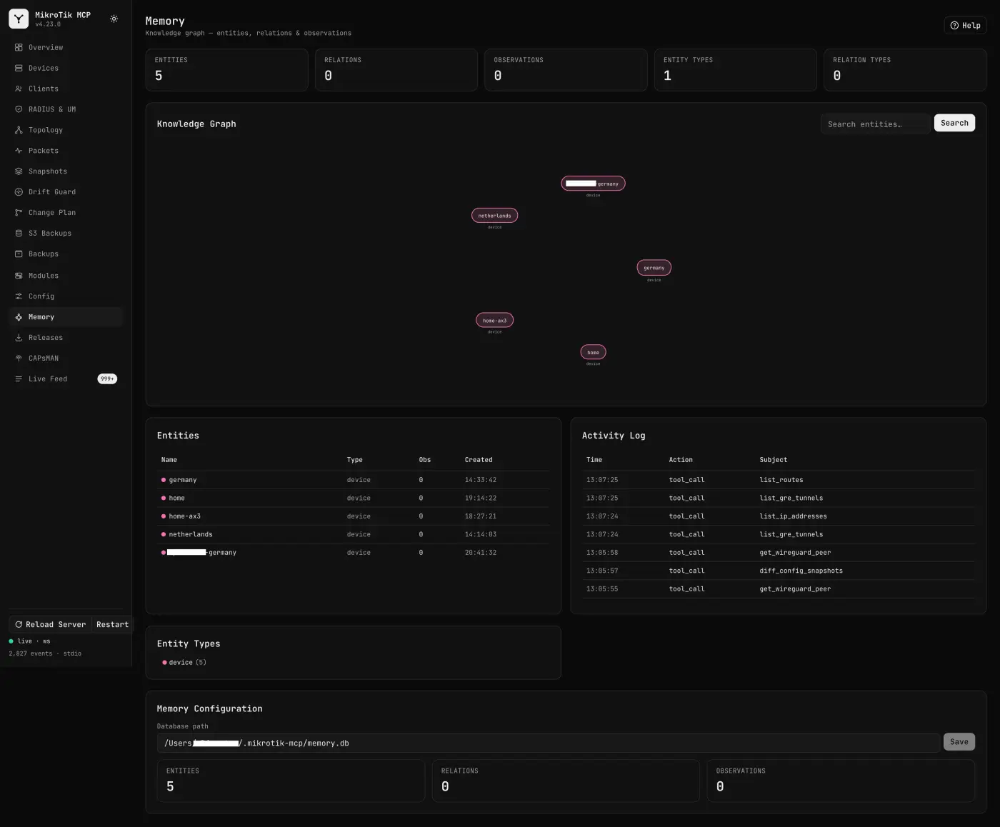
</div>

### RouterOS container knowledge and safe operations

`get_routeros_container_guide` provides shared, version-aware guidance adapted from
the `routeros-container` skill. Topics: `all`, `prerequisites`, `images`, `networking`,
`lifecycle`, `security`, `troubleshooting`. It performs no router I/O and needs no
container package. The equivalent Markdown resource
`mikrotik://knowledge/routeros-container` remains available in read-only/curated
sessions even when the `container` tool module is disabled.

- `audit-routeros-containers`: read-only readiness, storage and isolation audit.
- `setup-routeros-container`: approval-first deployment and application verification.
- `setup-v2ray-container-proxy`: the same safety baseline for proxy/TUN gateways.

These prompts include the same guide in MCP, Dashboard and Raycast. Instructions
cover physical device-mode confirmation, separately approved package/reboot work,
architecture variants, storage/volume backup, VETH/IPv4/IPv6 isolation, shared-list
dependencies, bounded lifecycle polling and Device/Group/Shared Memory boundaries.
They never authorize automatic router changes.

Container tools reject ambiguous targets and unsafe image-source combinations.
Use exactly one `id` (stable `.id`), unique `name`, or exact `tag` for lifecycle
operations. Start/remove and runtime-setting changes require confirmed stopped
state. Writes are read back; timeouts remain unknown and are never blindly retried.
`add_container` requires a name, VETH and root path in addition to one image source.
Current mount creation uses `list`; `name` remains an explicit legacy alternative.
Likewise `envlist`/`mounts` are legacy alternatives to `envlists`/`mountlists`;
inspect the target schema before selecting syntax. `memory_high` (and its deprecated
`ram_high` input alias) sends the actual RouterOS `memory-high` property.

Environment listing retrieves metadata without values. Container command logs omit
arguments; default activity-history redaction masks env/value/command fields, and
container detail masks sensitive properties. Application log text may still contain
secrets: collect only bounded, reviewed logs. These safeguards are not retroactive
cleanup of older logs and do not make arbitrary raw-command output secret-safe.

### VLAN knowledge and safe segmentation

The MCP includes a shared RouterOS VLAN guide adapted from the
`homelab-vlan-segmentation` skill. Read it with `get_vlan_segmentation_guide`
(`topic: "all"`, or `overview`, `discovery`, `layer2`, `policy`, `migration`,
`verification`) or the MCP resource `mikrotik://knowledge/vlan-segmentation`.
The tool belongs to `vlan-designer`; the reference resource remains available in
read-only/curated sessions and with Memory disabled. Reading it never contacts a router.

- **Audit:** `audit-vlan-segmentation` produces a read-only topology and prioritized
  cleanup report, with unknown evidence and client-test gaps made explicit.
- **Plan:** `setup-vlan-network` and `setup-guest-wifi` include the same guide in
  MCP, Dashboard → Prompts and Raycast → Prompts. They cover port/PVID/CPU membership,
  SSID/package differences, IPv4 **and** IPv6 isolation, protected management,
  remote routing, staged approval/rollback and real-client acceptance tests.
- **Remember:** store verified addresses/VLAN maps per Device. Share only intentionally
  reusable safeguards, or explicit Group policies. No private topology is seeded and
  the guide does not write Memory or grant authorization to change devices.

**Planner safety change:** `design_network_segment` is a partial IPv4 scaffold, not
an end-to-end isolation engine. It still defaults to `apply=false`. When
`internet=true`, `wan_interface` is now required to avoid unscoped NAT; use
`internet=false` when reusing existing NAT. `isolate_from` requires a reviewed
`isolation_before` forward-rule `.id`, checked again before writes. Non-/24 DHCP
requires an explicit valid `dhcp_range`; pools cannot include the gateway/network/
broadcast. Bridge/CPU tagged membership is deduplicated. Port admission/PVID,
filtering activation, SSIDs, INPUT/IPv6 policy and client verification remain separate
steps. Existing callers must supply these new prerequisites; incomplete requests
fail before writes. Apply is sequential, not idempotent, and has no automatic rollback.

Rebuild/redeploy the MCP version you actually run, then reconnect clients to refresh
their instructions/catalog. Editing this checkout alone does not upgrade an installed
service. No live router configuration is changed by loading these workflows.

**What's new.** Release notes for the running server version, shown on first launch after
an upgrade.

<div align="center">
  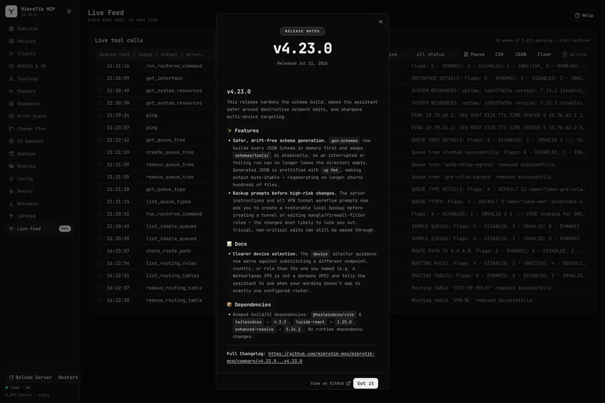
</div>

</details>

Full reference: **[docs/observability.md](docs/observability.md)**.

The dashboard includes a responsive operations shell with searchable grouped
navigation, pinned page shortcuts, a mobile drawer, and coordinated light/dark themes.
Its 41 pages are organised into eight task-based categories, with shared-scrollbar
navigation, category counts and common-term search. [Navigation guide](docs/dashboard-navigation.md).
The activity chart pairs a dotted canvas with animated successful-call trends and
independent error bars, with reduced-motion and pause controls.
BeUI now powers the dashboard's shared buttons, inputs, badges, checkboxes,
switches, selects, tabs, tooltips, loaders, theme toggle and animated numbers.
Animated Sidebar adds a collapsible icon rail while retaining search and pins.
Live Feed uses Animated Badges and an Expandable Action Bar; Overview, Devices
and Live Feed offer read-only Pull to Refresh with a keyboard-accessible button.
The local BeUI registry retains the 17 collections used by the dashboard and
their supporting components; unused component demonstrations have been removed.
The fixed **Operations Island** expands into live activity, router checks and
recent tool completions, using existing data without extra probes or configuration
changes. Missing and stale observations are explicitly labelled.
For frontend development, `bun run dev:dashboard` connects
the UI on port 9191 to the existing dashboard backend on port 9091.
See the [dashboard design system](docs/dashboard-design.md).

### DevFrame developer tools

Run the dashboard backend and the DevTools frontend in **two terminals** from
the repository root:

```sh
# Terminal 1 — MCP server and dashboard API
bun run start:dev --dashboard --dashboard-port 9091 --config /path/to/devices.json

# Terminal 2 — dashboard frontend with DevFrame enabled
bun run dev:tools
```

Open **http://127.0.0.1:9191/** and authorize the DevFrame dock with the one-time
code printed in the development terminal when prompted. If the port is occupied,
run `bun run dev:tools --port 9194` and open **http://127.0.0.1:9194/** instead.
The backend stays on port **9091**; `start:dev` alone does not enable DevFrame.

- **Data Inspector:** explore tool schemas, modules, prompts, App View coverage,
  device requirements, navigation and build diagnostics.
- **Devframe Inspector:** enable **Settings → Advanced → Show Devframe Inspector**,
  then filter **Functions** by `mikrotik:` for read-only MCP inspection queries.
- **A11y Inspector:** audit the current dashboard page for accessibility issues.

After changing tool declarations, run `bun run gen:schemas` to refresh the public
inspection data. Run `bun run build:ui` to populate build-artifact diagnostics.
DevFrame is development-only: it is not embedded in production builds, does not
load device credentials, and does not expose another router-execution endpoint.
See the [DevTools guide](docs/devtools.md) for search examples and security boundaries.

**Access Scope settings** can be edited directly in the dashboard: configure risk
ceilings, router allow/block lists and tool-name patterns, preview permission
decisions without executing tools, then review and apply with a 60-second
auto-revert window. The page distinguishes the operator policy, runtime session
restrictions and server read-only mode. See [Access Scope settings](docs/access-scope-settings.md).

## The tool catalog

**901 tools across 143 modules.** Full, always-current reference (parameters + risk per
tool) is generated from source: **[docs/tools-reference.md](docs/tools-reference.md)**.

| Group                    | Tools | Modules                                                                                                                        |
| ------------------------ | ----: | ------------------------------------------------------------------------------------------------------------------------------ |
| **System & Ops**         |   194 | system, network tools, investigations, service contracts, round-trip paths, Safe Mode, transactions, rollout, scheduled audits |
| **Security**             |   127 | firewall filter, NAT, address-lists, certificates, IP services, hardening, policy-as-code, attack detection                    |
| **VPN & Tunneling**      |   108 | WireGuard, IPsec, PPP, L2TP, PPTP, SSTP, OpenVPN, GRE/IPIP/EoIP/VXLAN                                                          |
| **Dynamic Routing**      |    99 | router-id, tables, rules, next-hops, filters, BFD, BGP, OSPF, RIP, PIM-SM, IGMP proxy, GMP, RPKI                               |
| **IPv6**                 |    90 | addressing, DHCPv6, ND, neighbours, pools, routes, firewall filter/NAT/mangle/raw                                              |
| **Tools**                |    67 | ping, traceroute, bandwidth test, sniffer, traffic generator, RoMON, Wake-on-LAN, SMS                                          |
| **Addressing & Routing** |    62 | IP addresses, IP pools, routing, DHCP, DNS                                                                                     |
| **Interfaces**           |    56 | interfaces, VLAN, bridge, wireless, PoE                                                                                        |
| **AAA**                  |    34 | RADIUS, User Manager, 802.1X                                                                                                   |
| **QoS**                  |    23 | queue types, queue trees, simple queues                                                                                        |
| **Switch**               |    18 | switch settings, ports, rules, port isolation                                                                                  |
| **Discovery & Meta**     |    11 | tool gateway (find/describe/invoke), server pulse, capability probe                                                            |
| **Memory**               |     9 | persistent knowledge graph                                                                                                     |

## Beyond the catalog

Higher-level workflows built on top of the per-scope tools:

- **[Change Plan & Dry-Run](docs/change-plan.md)** — preview commands as a
  terraform-style plan, apply under Safe Mode, show the exact `/export` diff, commit
  only if still reachable.
- **[Cross-Device Transactions](docs/transactions.md)** — coordinate Safe Mode across
  several routers: the recommended MCP workflow for related VPN, peering, route and
  ACL changes. Plan → stage → verify → commit with approval. Best-effort, not ACID;
  partial commits require manual recovery. Connection instructions and cross-device
  prompts steer the model here before independent writes, not for read-only tasks.
- **[Staged Fleet Rollout](docs/fleet-rollout.md)** — apply one change as canary → wave →
  fleet with a health gate and soak between waves, reverting everything already changed
  on the first failure.
- **[Scheduled Audits](docs/scheduled-audits.md)** — run the auditors on a cron with
  nobody in the loop and alert only on what changed since the previous run: new,
  worsened, resolved.
- **[Config Narrative](docs/config-narrative.md)** — turn a router's configuration into a
  plain-language architecture document with a topology diagram, and explain what the
  difference between two snapshots actually means.
- **[Attack Detection](docs/attack-detection.md)** — watch the fleet's logs for brute
  force, credential spraying and a login that succeeded after failures, correlate them
  into incidents with evidence, and block the source reversibly when you ask.
- **[Config Snapshots](docs/config-snapshots.md)** — store `/export` snapshots and
  time-travel diff any two, or one against the live device.
- **[Firewall Audit](docs/firewall-audit.md)** — find shadowed, broad, missing-default-drop,
  duplicate and dead rules, risk-scored, with one-click fixes.
- **[Security Hardening](docs/security-hardening.md)** — per-category audit+remediate
  pairs; audits read-only, fixes dry-run + snapshot + Safe-Mode first.
- **[Policy-as-Code](docs/policy-as-code.md)** — write your own compliance rules in
  YAML and lint a config snapshot offline; Markdown/JSON/SARIF, read-only, CI-able.
- **[Offline Simulator](docs/simulator.md)** — trace a hypothetical packet through NAT,
  routing and firewall against a snapshot; reports UNKNOWN rather than guessing.
- **[Traffic Flow](docs/traffic-flow.md)** — NetFlow/IPFIX collection and continuous
  top-talker / conversation / application analytics; flow metadata only, no payload.
- **[Port-Scan Detection](docs/port-scan-detection.md)** · **[Packet Capture Studio](docs/packet-capture.md)** ·
  **[Discovery](docs/discovery.md)** · **[Config Studio](docs/config-studio.md)**.

## Built-in prompts

MCP **prompts** are one-click guided workflows — authored as Markdown in
[`prompts/`](prompts/), so you can edit or add your own without touching code:

`harden-router` · `diagnose-connectivity` · `setup-guest-wifi` ·
`choose-vpn-solution` · `setup-wireguard-vpn` · `setup-ipsec-site-to-site` ·
`setup-l2tp-ipsec-roadwarrior` · `setup-tunnel-between-sites` · `backup-and-document`

See **[docs/prompts.md](docs/prompts.md)**.

Browse the live library under **Workspace → Prompts** in the dashboard, or run
**Prompt Library** in Raycast (also available in the Fleet Menu Bar). Search and
filter workflows, fill their required inputs, add your own request and target
router, then preview and copy the completed brief into an MCP-connected assistant.
Nothing runs on a router while composing. The dashboard links open ChatGPT/Claude
without including your request in the URL; paste and send it yourself. Raycast also
offers **Ask Raycast AI for a Plan** when AI access is available: this sends the
request to Raycast AI for advice, not MCP tool execution.

## Transports

| Transport           | When                              | Run                                                              |
| ------------------- | --------------------------------- | ---------------------------------------------------------------- |
| **stdio** (default) | Claude Desktop, local MCP clients | `mikrotik-mcp serve`                                             |
| **streamable-http** | Remote / shared, behind a proxy   | `mikrotik-mcp serve --transport streamable-http --mcp-port 8000` |
| **sse**             | Legacy HTTP clients               | `mikrotik-mcp serve --transport sse`                             |

HTTP transports expose `POST /mcp` and `GET /health` with DNS-rebinding protection. See
**[docs/transports.md](docs/transports.md)**.

## Configuration

### Update MCP settings through tools

The **MCP Settings** module (`mcp-settings`) manages host-side settings without
contacting a router, even when the dashboard is disabled:

| Tool                      | Purpose                                                                       |
| ------------------------- | ----------------------------------------------------------------------------- |
| `get_mcp_settings`        | Read editable settings, revision, config path and pending change              |
| `get_mcp_settings_schema` | Discover allowed fields and validation limits                                 |
| `preview_mcp_settings`    | Validate a partial patch and inspect its diff and restart requirements        |
| `update_mcp_settings`     | Back up and persist an approved patch to the source JSON, with timed rollback |
| `confirm_mcp_settings`    | Keep the pending tool-created change after readback                           |
| `rollback_mcp_settings`   | Restore its local backup before confirmation                                  |

Editable fields cover MCP tool pagination, App views and capability gating;
SSH pooling; dashboard retention/body capture/redaction; Memory enablement; and
startup update checks. Partial patches preserve omitted settings. For example,
preview `{"changes":{"ssh":{"keepAlive":true,"idleTimeout":60000}}}`,
then apply the same changes with the returned `revision` and `confirm:true` only
after user approval. Read back and confirm using the **new** revision and
`pending_id` (the update result's `pendingId`, also `pending.id` in readback).

Writes are unavailable in read-only mode. Devices, credentials, listener addresses,
file paths, access ceilings, tool restrictions and probe allowlists remain
operator-managed. These tools cannot disable redaction; enabling body capture
requires redaction. They return no credential values. Config files and backups
are written with owner-only permissions (`0600` on POSIX).

Dashboard and tool edits in the same process share one pending transaction; stale revisions and
conflicting edits are rejected. Unconfirmed tool updates roll back after **60s**
by default (configurable from 30–600s) **while the process remains alive**.
Never restart with a pending update: confirm first, then restart separately if
the preview requires it. MCP presentation, dashboard recorder and update-check
changes need a restart for full activation. Memory enablement is checked on the
next operation; SSH settings affect subsequent calls/new connections and new idle
timers without forcibly disconnecting existing sessions.

The saved config path is returned by the tools. If the server was started from
environment variables alone, use `--config <path>` on future starts; CLI/env
overrides can still take precedence. A configured value is not evidence of a
restart or of router connectivity.

### Environment and CLI

Settings come from `MIKROTIK_*` env vars or matching CLI flags (defaults → env → flags):

| Variable                      | Flag               | Default     | Purpose                             |
| ----------------------------- | ------------------ | ----------- | ----------------------------------- |
| `MIKROTIK_HOST`               | `--host`           | `127.0.0.1` | RouterOS host                       |
| `MIKROTIK_USERNAME`           | `--username`       | `admin`     | SSH user                            |
| `MIKROTIK_PASSWORD`           | `--password`       | —           | SSH password _(or use a key →)_     |
| `MIKROTIK_KEY_FILENAME`       | `--key-filename`   | —           | SSH private-key file path           |
| `MIKROTIK_KEY_PASSPHRASE`     | `--key-passphrase` | —           | Passphrase for an encrypted key     |
| `MIKROTIK_JUMP_HOST`          | `--jump-host`      | —           | SSH bastion to tunnel through       |
| `MIKROTIK_CONFIG_FILE`        | `--config`         | —           | JSON file of named devices          |
| `MIKROTIK_DEVICES`            | `--devices`        | —           | Inline JSON of named devices        |
| `MIKROTIK_MCP__TRANSPORT`     | `--transport`      | `stdio`     | `stdio` / `streamable-http` / `sse` |
| `MIKROTIK_SSH__KEEP_ALIVE`    | `--ssh-keep-alive` | `true`      | SSH connection pooling              |
| `MIKROTIK_DASHBOARD__ENABLED` | `--dashboard`      | `false`     | Real-time observability dashboard   |

Full table (HTTP host, allow-lists, timeouts, dashboard options, `MIKROTIK_LOG_LEVEL`):
**[docs/configuration.md](docs/configuration.md)**.

## Documentation

| Doc                                                                 |                                                              |
| ------------------------------------------------------------------- | ------------------------------------------------------------ |
| [Getting started](docs/getting-started.md)                          | Install, verify, first run                                   |
| [Configuration](docs/configuration.md)                              | Every env var & flag                                         |
| [Device capabilities](docs/capabilities.md)                         | What a router supports; how tools are gated on it            |
| [Alerting](docs/alerting.md)                                        | Rules that reach out — Slack, Discord, ntfy, webhook, MCP    |
| [Multiple devices](docs/multi-device.md)                            | Manage several routers; per-call targeting                   |
| [Connecting clients](docs/connecting-clients.md)                    | Claude Desktop, stdio, HTTP                                  |
| **[Observability](docs/observability.md)**                          | Real-time dashboard: live feed + analytics, SQLite           |
| [Safe Mode](docs/safe-mode.md)                                      | Transactional changes                                        |
| **[Cross-Device Transactions](docs/transactions.md)**               | Two-phase commit across several routers                      |
| **[Staged Fleet Rollout](docs/fleet-rollout.md)**                   | Canary → wave → fleet with health gates and auto-revert      |
| **[Change Plan & Dry-Run](docs/change-plan.md)**                    | Preview commands, apply with the exact diff + auto-rollback  |
| **[Traffic Flow](docs/traffic-flow.md)**                            | NetFlow/IPFIX collection + top-talker analytics              |
| **[Attack Detection](docs/attack-detection.md)**                    | Live attack incidents from logs; guarded, timed blocking     |
| **[Firewall Audit](docs/firewall-audit.md)**                        | Shadowed/broad/dead rules, risk-scored                       |
| **[Security Hardening](docs/security-hardening.md)**                | Per-category audit+remediate, snapshot + Safe-Mode           |
| **[Scheduled Audits](docs/scheduled-audits.md)**                    | Auditors on a cron, alerting only on run-over-run changes    |
| **[Policy-as-Code](docs/policy-as-code.md)**                        | Your own YAML compliance rules, linted offline → SARIF       |
| **[Config Narrative](docs/config-narrative.md)**                    | Config → architecture doc + Mermaid; consequence-level diffs |
| **[Offline Simulator](docs/simulator.md)**                          | Trace a packet through firewall + routing, no device         |
| **[VPN guide](docs/vpn-guide.md)**                                  | Every tunnel type + how to build it                          |
| [Prompts](docs/prompts.md)                                          | The 9 guided workflows                                       |
| [Architecture](docs/architecture.md) · [Security](docs/security.md) | How it's built · credentials & risk gating                   |
| [Tool reference](docs/tools-reference.md)                           | The full generated catalog                                   |
| [Development](docs/development.md) · [Docker](docs/docker.md)       | Build, test, deploy                                          |

## Security

Talks to RouterOS over SSH using credentials you supply; nothing is sent anywhere else.
Tool values are quoted/escaped to prevent console-command injection. Destructive tools
are annotated so clients can require confirmation. Details:
**[docs/security.md](docs/security.md)**. Only point this at devices you're authorized to manage.

## License

[MIT](LICENSE). Reuse freely. No warranty.

---

<div align="center">
  <br/>
  Made with ❤️ by <a href="https://github.com/ali-master">Ali Torki</a>
</div>
